 原文 by [如何打造安全的容器云平台](https://blog.qiniu.com/archives/7743)  

Docker 是 2015、2016 年最火的技术之一，也是具有颠覆性的技术。对 PaaS、微服务和 DevOps 来说 Docker 都是非常好的落地实践技术。而容器安全也一直是大家非常担心的问题。在 SFDC 北京 Security 大会上，七牛云布道师陈爱珍介绍了容器的安全现状。本文是对她演讲内容的整理。 
## 给传统安全解决方案的挑战  
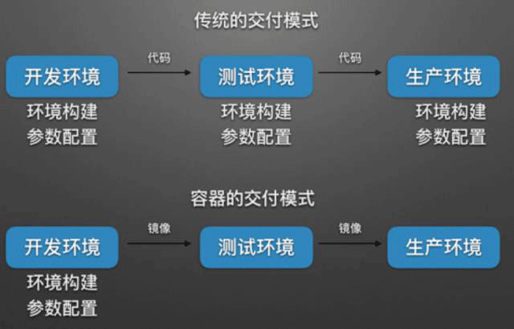  
Docker 的出现，最大的一个变革就是对应用交付模式的一个变革。因为它对生产环境进行了封装，可以基于镜像快速部署，还可以动态的迁移和弹性伸缩。可以看到，在过去如果需要去发布一个应用，首先要在开发环境去构建一个环境，去做安装、配置，然后在测试环境做一个安装配置，再构建一个生产环境。传统的交付模式交付的内容是代码，把这个开发完的代码交付给测试，再把这个测试好的代码交付到生产去部署去运行。这样会存在什么样的问题呢？一是需要从 0 构建三个环境;二是不能确保这三个环境是完全一样。在不是一样的情况下，就会导致在生产运行的过程中可能会有运行失败的情况。而 Docker 的出现改变了这种交付模式，它交付的对象是镜像而不是应用代码。镜像可以对环境进行一个封装，封装之后测试环境和生产环境使用的环境就和开发环境是完全一样的。Docker 在运维上面来讲带来的一个好处就是它是可读的。使用 Docker  技术之后，在生产环境上做的所有配置都是写在文件里，比如 Dockerfile , yml 文件等，之后再通过命令对这个文件进行一个执行，静态文件就是一个运行时。过去在生产环境中做了任何的配置修改，如果在管理上面不是很严谨，这个变更就不会有人知道，也没有记录，下次就可能不记得哪里修改了。但 Docker 是可读的，所以它有个非常好的好处就是在很长的一段时间里，都能留下历史的配置状态。而且因为是可读的，每个人对生产环境都可以有很好的理解。    

Docker 对传统的应用交付进行了非常大的一个颠覆性的变革。那么它的特性会给传统的安全方案带来什么挑战呢？  

首先 Docker 本身是提供了新的攻击点，以前可能攻击虚拟机，Docker 出现之后增加了一个攻击对象。其次因为 Docker 是与宿主机共享内核，通过攻破内核就可以进入到宿主机上的其他容器里，所以也提供了新的攻击机会。第三就是 Docker 自身是一个软件，只要是软件就可能会有漏洞，所以 Docker 的漏洞也是一个新的挑战。    

然后容器需要调度系统，如果只是使用单一的 Docker ，可能享受的是它的环境封装，迁移的方便性，但是在大规模使用容器之后，就要关心它的调度怎么做，那么调度系统也是一个新攻击的点。而且这种新部署方式也会对传统的安全工作带来一些新影响。  

最后就是容器在运维和配置方面和传统的方式不一样，也会有一些新的安全问题。所以 Docker 出现之后，提出了很多新的安全解决方案的挑战。对传统安全来说，容器相当于是虚拟机，它就是一个运行环境，所以更多的是做的传统的基础层这种安全，来增加从外层到内层的一个安全性。在这就不去聊传统的安全是怎么做，无论使用容器还是虚拟机，传统的方案都是要做的。本文主要聊一聊 Docker 本身安全如何做。  

## 对容器安全性的担忧
每次讲 Docker 时都会把它拿过来和虚拟机做一个对比，因为 Docker 也是一种轻量级的虚拟技术，只是虚拟机是对物理机的虚拟，而 Docker 是对操作系统层的虚拟。因为它和主机是共享内核的，所以它非常轻量，启动速度也非常快。如果启动一个虚拟机需要加载一个完整的 OS ，而容器则是共享宿主机的操作系统，不需要重新全部加载。还有一个特点是它可以动态的迁移，我们可以很容易的把一个容器在多台机器上进行动态的迁移。在规模使用容器时，它可以进行一个弹性的扩展。  
    
这里有一个容器和虚拟机的对比图，图里可以看到，容器之所以非常的轻量，是因为它减少了两个层，而且容器可以直接运行在 Baremetal 上 。那在使用容器技术时对容器安全性的有哪些担忧？主要有以下几个方面：  
1. 操作系统级的虚拟化不如物理级虚拟化安全传统上来讲，虚拟机肯定不如物理机的隔离强，物理机的隔离也不比跨机房的隔离强。物理机比虚拟机的安全性是要强的，这个我们是不否认的，因为从物理上去隔绝一个事情，肯定比你通过一些技术手段来解决安全性要高一些。
2. 容器与宿主机共用一个内核，只要攻击内核，它就可以通过这个容器，访问到宿主机上的东西，或进入其他的容器。共享内核的安全性是一个问题。
3. Namespace，cgroup 不安全，且并非所有资源都已隔离。这两种隔离都没有进行一个非常完整的隔离，目前它并不是像虚拟机一样完全隔离的模式。
4. 同一宿主机上的容器可以通过挂载共享宿主机文件系统，如果在一台主机上，通过挂同一个目录到不同的容器里面，那么不同的容器就可以访问同一个目录，所以这个时候也是会有一些安全性的问题。只要进入其中一个容器，就可以通过这个共同挂载的目录进入到其他容器里面去。
5. 网络的隔离是比较弱的，因为宿主机上所有的容器是使用同一张网卡，那么比如发生 DDOS 情况，对某个容器的攻击就会导致宿主机上所有容器都会受到安全的影响。
6. Docker 产品自身的安全，本身是有安全漏洞的，Docker本身是软件，只要是软件就可能会有漏洞,还有对 Docker Daemon 的攻击。
7. 用户自定义的配置文件安全漏洞，因为容器是通过配置文件来进行一个构建的，所以我们在去定义配置文件的时候，会有一些安全漏洞的存在。

## Docker 自身的安全问题
从下图可以看一下容器它自身的安全的几个方面：  
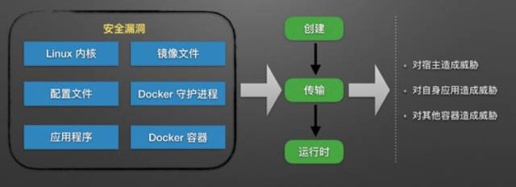    
首先是在构建时，就是它自己本身，比如说内核是有安全漏洞的，然后镜像文件因为是配置出来的，也可能会有一些安全漏洞，应用程序也有安全漏洞，Docker 软件本身也可能有安全漏洞，所有它的安全漏洞的点就会非常多。其次把整个环境构建之后，在创建传输和运行的过程中，也会存在安全的问题。比如说把一个镜像下载到生产，那这个镜像本身是不是安全的，传输的过程中有没有被篡改，运行的过程中，使用这个容器的应用是不是安全的，有没有漏洞，特别是对于公有云的服务商来说，并不知道部署在公有云的应用本身是不是安全的，特别是有一些应用开发本身对安全的意识是比较薄弱的，所以当它把一个不安全的应用部署到容器平台之后，这也会对公有云平台上其他一些运营在同一台机器上的容器有一个攻击。所以这个也会有一些安全的问题。容器的安全问题主要考虑对宿主机造成的威胁，对自身运行的应用造成的威胁，以及会对宿主机上其他的容器造成的威胁。  

## Docker 在安全性上做的努力
那么 Docker 安全吗？事实上 Docker 经过这两年的发展，它在安全上做了非常多的努力。现在官方宣称，在默认的情况下 Docker 是足够安全的。所以在实践 Docker 的时候，就是相对 2014 年或者 2015 年的时候，大家对容器不安全性的考虑，现在可以稍微进行一些消除。下面讲讲 Docker 这几年对安全性做的一些努力。下图列举了几种容器默认的安全设置：  
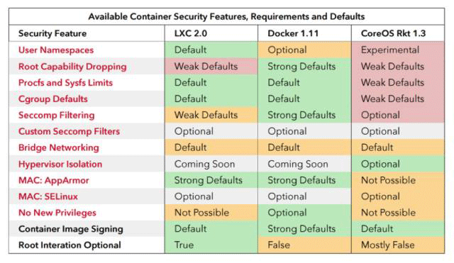    
通常讲容器的时候都会讲 Docker，这个是用的比较广的容器，事实上还有Linux LXC，CoreOSRkt，大家可以了解一下每一种容器它的一个默认安全设置的情况。下面主要讲一下和 Docker 相关的安全情况。首先是 Namespace，Docker 的隔离是基于 Linux 的 Namespace 来做的，主要是基于六种：  
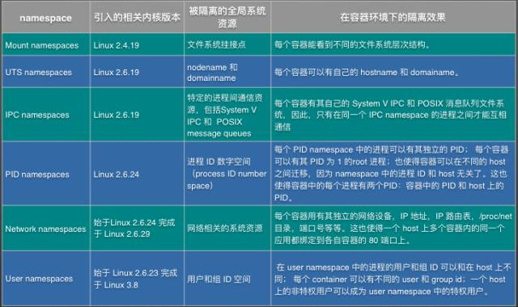    
重点就讲一下 UserNamespace。过去容器里的 root 就是 Host 的 root，如果能够攻击到容器里，就可以获取到 Host 的 root 权限。而 User Namespace 可以让容器里使用的 root，到 Host 上就不是 root 了。第二个是对资源使用的限制。因为容器与主机是共享资源，需要对每一个容器使用的资源进行控制，如果不对容器使用的资源进行控制，当容器遇到恶意攻击时，它就会把整个主机资源占用完，然后就会影响主机上其他容器的运行，所以需要对容器使用主机上的资源进行限制。比如说 CPU，内存这些资源，容器在出现异常时就不能够使用主机上的资源，它只能使用这些已分配的资源，这样可以有效隔离它对主机上其他容器的影响。  
第三个是 Capability。Linux 将传统超级用户的特权划分为多个 Capabilities，有接近40项的 Capabilities，可以单独启用或者关闭，因此同为 root 用户，权限却因 Capabilities 的不同而存在差异。Docker 为了确保容器的安全，仅仅支持了其中的 14项基本的 Capabilities。针对容器可以去设置这些能力是否开启。  
```
–privileged 参数设为 true，Docker 容器的 root 用户将获得37 项 Capabilities 能力（在生产不建议设置为true）
–cap-add 参数添加以及移除 Capabilities
–cap-drop 参数移除 Capabilities
```
第四个是内核强制性的访问控制（MAC），这个也是非常重要的。Docker 容器共享宿主机的内核，在内核的安全上存在不少问题，需要针对内核的破坏做防御。现在支持的方式有三种:  

1. SELinux (Secure Enhanced Linux)：是一个Linux安全策略机制，允许管理员更加灵活的定义安全策略。通过策略规定哪些域可以访问哪些上下文、哪些进程可以访问哪些文件。
2. AppArmor 类似于SELinux，主要的作用是设置某个可执行程序的访问控制权限，可以限制程序 读/写某个目录/文件，打开/读/写网络端口等等。
3. GRSecurity 是一个对内核的安全扩展，通过智能访问控制来阻止内存破坏，预防0day漏洞。 

这三种方式可以限制容器在使用 Host 主机内核或者资源时，去对一些文件或者一些能力进行一个控制，不让它去进行访问。容器目前报出来的一些安全漏洞很多是通过加强对内核的访问控制来进行一个隔离的。  

第五个是 Seccomp（secure computing mode），就是安全计算模式，这个模式可以设置容器在对系统进行调用时进行一些筛选，也就是所谓的白名单。它可以去指定允许容器使用哪些的调用，禁止容器使用哪些调用，这样就可以增强隔离，它其实也是访问控制的一个部分。  

通过使用“–security-optseccomp=<profile>”标记来指定自定义的 seccomp 描述文件：  

`$ docker run -d –security-opt seccomp:allow:clock_adjtimentpd`  
这条命令将会允许容器内使用 clock_adjtime 调用  

`$docker run -d –security-opt seccomp:deny:getcwd/bin/sh`  
这条命令将会禁止容器内执行的 shell 查询当前自己所在的目录  

第六个是 Docker client 端与 Docker Daemon 的通信安全。默认的通信方式使用的 anon-networked Unix ，这种方式并不是安全的，可以通过配置 HTTPS，让 Docker Client 与 DockerDaemon 访问时，是通过 HTTPS 的方式，这样可以加强通信过程中的一个安全性。  

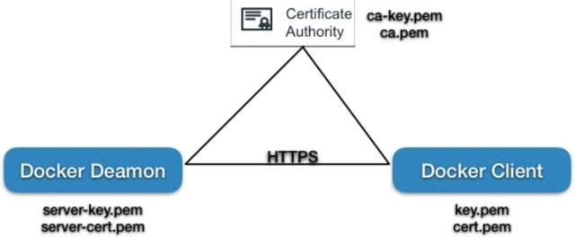    
```
$ dockerd –tlsverify –tlscacert=ca.pem–tlscert=server-cert.pem –tlskey=server-key.pem   -H=0.0.0.0:2376
$ docker –tlsverify –tlscacert=ca.pem–tlscert=cert.pem –tlskey=key.pem   -H=$HOST:2376 version
```
第七个是镜像扫描的功能，Docker Security Scanning。在下载镜像或者构建镜像的过程中，可能最初的 Baseimage 是官方提供的，但是在使用的过程中，可能基于这个镜像做了很多新的镜像，这个镜像投入到生产之前到底是否安全。Docker 现在提供了一个功能，就是可以对镜像进行安全的扫描，它可以分析这个镜像本身是不是安全的，就是所谓的可信内容，就是我们的内容首先是可信的。  

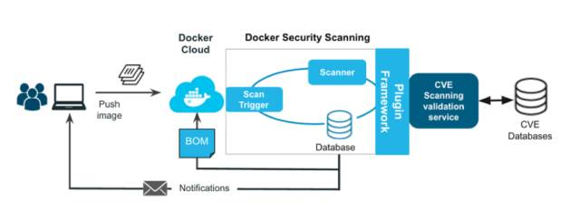    
针对镜像的安全还有一个就是镜像签名（Docker Content Trust），用于防止镜像在传输的过程中被篡改。给每个镜像在传输的过程中都进行签名的配置，确保这个镜像传输的过程中它是安全的。  
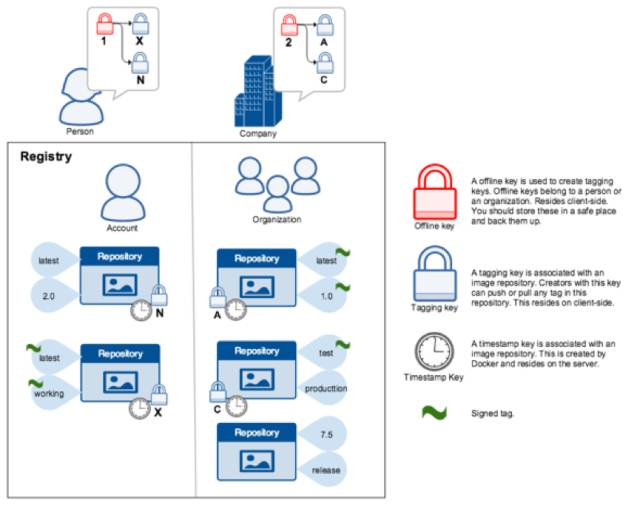    
下面就是 Docker 本身已知的安全漏洞，Docker 本身被报出来的漏洞不是特别多，可以看一下从 2014、2015、2016 年都是有的，有兴趣的同学可以到下面这个网站了解。  
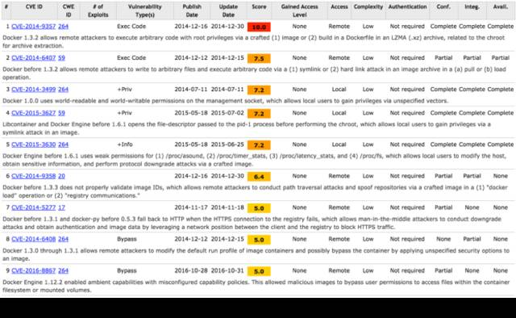   
From: https://www.cvedetails.com  

这里列举了两个还没有解决的：  

1）CVE-2015-3290,5157：Linux kernel 中存在本地提权漏洞。本地攻击者可利用该漏洞获取提升的权限，或使内核崩溃。  

2）CVE-2016-5195：Linux 内核的内存子系统在处理写时拷贝（Copy-on-Write）时存在条件竞争漏洞，导致可以破坏私有只读内存映射。一个低权限的本地用户能够利用此漏洞获取其他只读内存映射的写权限，有可能进一步导致提权漏洞。部分缓解措施:在一些操作系统这个漏洞可由 seccomp 和 ptrace 过滤的组让 /proc/self/mem 只读进行缓解。  

我们可以看一下这两个漏洞的特点，它的特点是都是基于 Linux 内核的，因为容器使用的是 Linux 内核，所以它本身的漏洞基本上都是基于内核爆发出来的，所以在做安全构建的时候，是要去加强内核的一个安全。在解决这些方案的时候，都是去通过来对内核进行一些限制，来解决这些安全漏洞的。  

那现在 Docker 还有一些什么样已知的，没有解决的问题，主要有以下几个：   

* Docker V1.10 前的版本没有 usernamespace ,而之后的版本默认不开启
* Docker Client 使用 Rest API 与 Docker Daemon 通信存在安全问题
* 容器的网络端口默认会绑定到所有的网卡上
* Dockerfile 的复杂性和 Docker 镜像处理存在风险
* Docker Daemon 必须以 root 权限运行
* 同一台主机上的容器因为共享网桥可以相互通信
* Docker Client 默认情况下不验证 TLS 证书
* 容器中有些操作需要 root 权限，如文件系统挂载
* /proc，/sys，/dev，syslog，time，系统命令等未做隔离

刚才我讲的基本上都是容器自身的，就是单独去考虑一个容器时，容器自身的一个安全性的问题。现在要想的是，当我们构建一个云平台的时候，这时容器是大量的，也可能是多租户的，特别是公有云，用户上传上来的应用是否安全，在这种情况下，怎么来去考虑一个容器平台的安全问题。七牛的数据处理平台也是基于容器构建，在平台上不仅运行七牛自己的图片或音视频的处理程序，也支持用户在我们平台上运行他们自己的数据处理程序，这样可以让计算离存储资源更近，处理的时间缩短，还可以无缝的对接七牛数据处理平台上所有其他的数据处理算法。同时还接入运行了一些专业的第三方数据处理的算法，为存储用户提供丰富的数据处理算法。所以七牛的数据处理平台也是一个多租户的运行环境。   

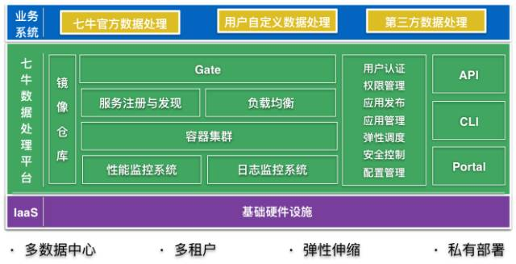    
这个平台可以看到它有两个数据流，一个是从上往下走，就是一个业务请求流，用户请求通过这 Gate 到后端访问容器里的应用。第二是是管理流，是从右边来进行用户的权限管理，应用发布，调度之类。这个平台考虑的问题就是多数据中心，多租户和弹性伸缩的问题。那么在构建容器平台时去考虑安全问题，需从哪些方面去考虑呢？主要是从四个方面：  
* 基础架构层安全
* 容器调度层安全
* 容器自身的安全
* 应用系统层安全

首先基础架构层的安全肯定是要做的，然后因为容器在大规模使用的情况下需要一个调度系统来做集群管理，所以这个调度系统层也是需要安全的，再就是容器自身的安全和部署在上面的应用是安全的。安全主要从三个方面入手：可信内容，授权访问，平台安全。   

下面我列举一些在实施容器平台时做的安全措施：  

* 建立容器云平台的安全基线
* 容器 CI/CD 过程加密验证
* 加强平台的权限访问控制或者 API 密钥管理
* 加强容器的安全测试及渗透测试
* 加强安全漏洞扫
 
第一步不管是传统模式还是容器模式，都要给生产安全建立一个安全基线。CIS 制定了容器的安全基准，最新的版本是 1.11 的，我这里总结了一些，但并不是完整的，大家如果了解完整的可以官方发布的 Benchmark。    

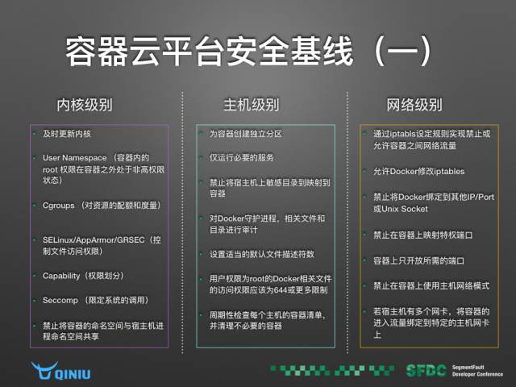    
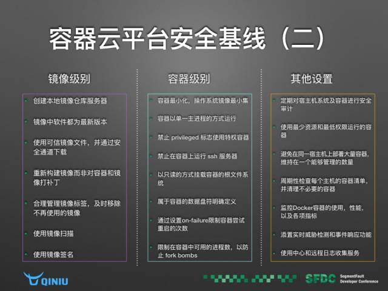    
第二个，容器在大规模使用情况下，肯定是需要有一个调度系统让它进行一个自动的伸缩，恢复。在使用调度系统的时候，也要去考虑调度系统的安全性，这里我列举了一些调度系统的安全：   
* 节点间启用 TLS 加密
* 不同的用户分为不同的角色，不同的访问权限
* 配置 ACLs 来限制用户只能在 WebUI/API 看到自己的任务
* 通过管理节点使用安全端口，Authorization 会应用到所有 http 的请求上
* 通过管理节点交换数据、修改系统状态，而且只有管理可以访问后端存储
* 管理节点支持证书、token、和基本信息三种认证方式
* 搜索有漏洞的软件以及获取镜像的元数据
* 在运行镜像之前和其他授权中心通信
* 通过 Authorizer 接口添加自己特有的安全策略

第三个就是从应用开发到交付过程的安全。因为现在是基于镜像进行交付的，需要对镜像从 CI ，到部署到生产的过程，每一次都将会对它进行签名认证，这样确保镜像最终到生产时是一个安全的，可信的一个资源。从下图可以看到，最后是做了三层的验证。  

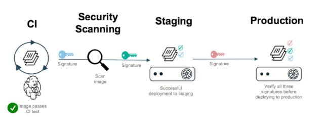    
