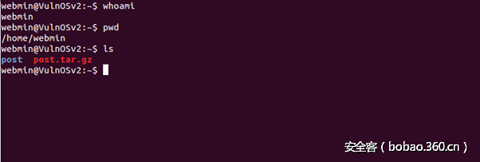
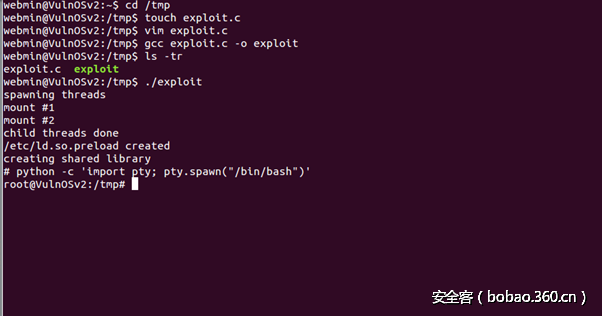
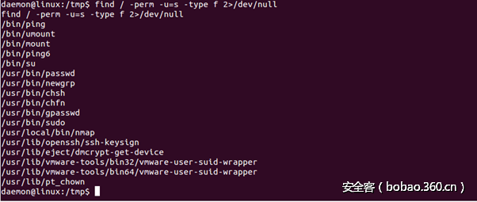
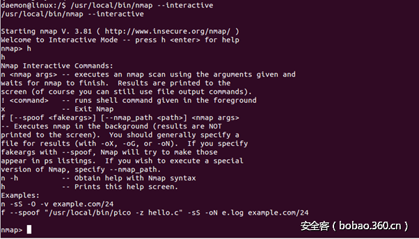
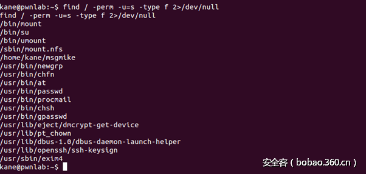
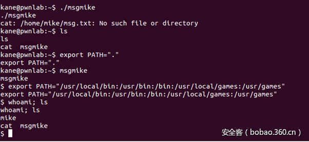

原文 by 安全客

在渗透测试或者漏洞评估的过程中，提权是非常重要的一步，在这一步，黑客和安全研究人员常常通过exploit,bug,错误配置来提升权限。本文的例子都是在虚拟机里测试的，不同的虚拟机可以从Vulnhub下载。
  

  
## 实验一：利用Linux内核漏洞提权
  

  
VulnOS version 2是VulHub上的一个Linux提权练习，当打开虚拟机后，可以看到
  

  

  

  
获取到低权限SHELL后我们通常做下面几件事
  

  
1.检测操作系统的发行版本
  

  
2.查看内核版本
  

  
3.检测当前用户权限
  

  
4.列举Suid文件
  

  
5.查看已经安装的包，程序，运行的服务，过期版本的有可能有漏洞
  

  

  
`$ lsb_release -a`
  
查看系统的发行版本
  

  

  

  

  

  

  
`$ uname -a`
  
查看内核版本
  

  

  

  

  
每次在提权的时候，我们都会一次又一次的测试，我们将搜索所有可能的提权技术，并依次应用，直到成功。我们将测试不同的内核exploit,也会暴力破解账号。这个例子我们知道操作系统采用的是Ubuntu 14.04.4 LTS，内核版本是3.13.0-24-generic，首先我们尝试利用overlayfs,这个exploit会工作在Ubuntu 12.04/14.04/14.10/15.04的linux内核3.19之前和3.13.0之后，我们测试一下。
  

  
我们首先移动到/tmp目录，然后新建一个文件，粘贴exploit代码进去
  

  
依次运行：
  

  
```
  
$ cd /tmp
  
$ touch exploit.c
  
$ vim exploit.c
  
```
  
vim保存推出后，我们编译代码
  

  
`$ gcc exploit.c -o exploit`
  

  

  

  
现在执行，如果提示没有权限，还需chomd 777 ./exploit
  

  
`$ ./exploit`
  

  

  
通过截图可以看到我们已经获取到了root权限，接下来获取交互式的shell
  

  

  
`$ python -c 'import pty; pty.spawn("/bin/bash")'`
  

  
如果提权失败了，我个人建议你测试几个其他的exploit,新的内核版本也可以试试
  

  
Linux Kernel 3.13.0 < 3.19 (Ubuntu 12.04/14.04/14.10/15.04) – 'overlayfs' Local Root Shell
  

  
https://www.exploit-db.com/exploits/37292/
  

  
Linux Kernel 4.3.3 (Ubuntu 14.04/15.10) – ‘overlayfs’ Local Root Exploit
  

  
https://www.exploit-db.com/exploits/39166/
  

  
Linux Kernel 4.3.3 – 'overlayfs' Local Privilege Escalation
  

  
https://www.exploit-db.com/exploits/39230/
  

  
最后核心提示：内核exploit提权有风险，有可能会崩溃系统。
  

  

  

  
## 实验2：利用低权限用户目录下可被Root权限用户调用的脚本提权
  

  
Mr.Robot是另一个boot到root的挑战虚拟机，我拿这个例子来告诉你为什么suid程序在提权的过程中是重要的，如果你以前对suid没有了解，可以参考https://en.wikipedia.org/wiki/Setuid
  

  
我们首先查看下当前用户
  

  

  

  
通过截图可以得知，当前用户为"daemon"，我们接下来提权"daemon"到"root"
  

  
这台Ubuntu 14.04运行linux内核3.13.0-55-generic，我尝试已有的exploit都失败了。
  

  

  

  
这次我们通过寻找系统里可以用的SUID文件来提权。运行：
  

  

  
`$ find / -perm -u=s -type f 2>/dev/null`
  
得到如下列表：
  

  

  
通过截图，我们发现nmap居然有SUID标志位，来看看nmap版本
  

  

  

  
一个非常老的nmap版本，但是这个版本的nmap如何帮我们提权呢？
  

  
nmap支持“interactive.”选项，用户能够通过该选项执行shell命令，通常，安全人员会使用该命令来避免他们使用nmap命令被记录在history文件中
  

  

  

  
因为nmap有SUID位，所以通过"!sh"我们会获取到一个root权限的shell
  

  

  

  
在你的渗透过程，如果发现Nmap 3.48 有SUID位，可以按照本文的例子做下测试。
  

  

  
## 实验3：利用环境变量劫持高权限程序提权
  

  
PwnLad是笔者最喜欢的挑战，一个攻击者有几个账号，但是都不是root权限。
  

  
我们当前登录的是"Kane"账号，当前没有有效的内核exploit，也没有其他可以利用的suid文件
  

  

  

  
只有在Kane的home目录下有一个"msgmike."文件
  

  

  

  
使用file命令查看下这个文件
  

  

  

  
从截图可以看到，这是一个ELF 32位 LSB执行文件，但是当我们执行文件的时候，报错了
  

  

  

  
通过报错信息我们可以看到msgmike调用cat命令读取/home/mike/msg.txt文件。
  

  
针对这种情况，我们可以通过设置bash的$path环境变量来利用，通常的$PATH包含
  

  

  

  
然而当我们调用cat命令的时候，会从以上目录来寻找cat，如果我们添加.到$PATH环境变量，则会先从当前目录来寻找cat指令
  

  
新建cat,添加执行权限
  

  

  

  
这样当我们再次运行./msgmike命令的时候，就会触发当前目录下的cat(/bin/sh)，从而提权。完整的exploit如下
  

  
## Reference
[实战Linux下三种不同方式的提权技巧](http://bobao.360.cn/learning/detail/2984.html)
[Scripted Local Linux Enumeration & Privilege Escalation Checks](https://github.com/rebootuser/LinEnum)   
[Linux_Exploit_Suggester](https://github.com/PenturaLabs/Linux_Exploit_Suggester)   
