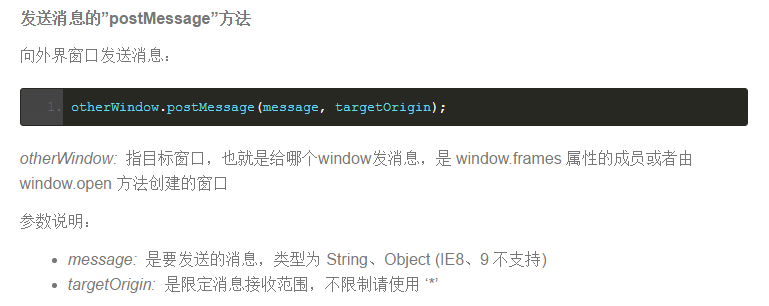
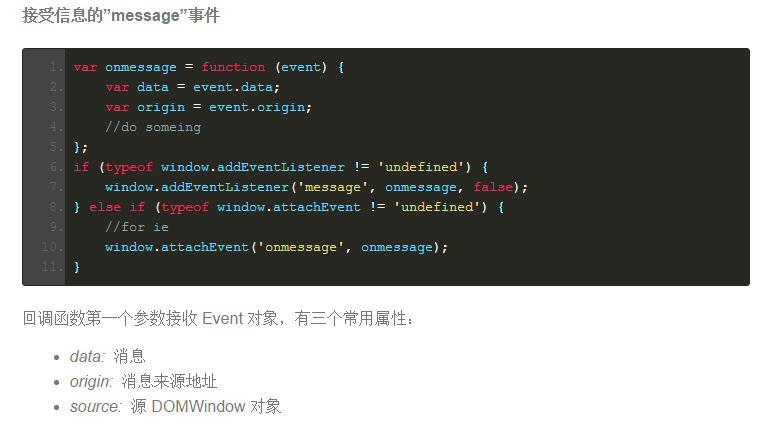

# JavaScript 跨域方法 #
-------------------------------------------------------------------------------------------------------------
跨域并非浏览器限制了发起跨站请求，而是跨站请求可以正常发起，但是返回结果被浏览器拦截了。注意：有些浏览器不允许从HTTPS的域跨域访问HTTP，比如Chrome和Firefox，这些浏览器在请求还未发出的时候就会拦截请求，这是一个特例。  

## 一、 JSONP ###
JSONP（JSON with Padding）技术实际和Ajax没有关系。我们知道&lt;script&gt;标签可以加载跨域的javascript脚本，并且被加载的脚本和当前文档属于同一个域。因此在文档中可以调用/访问脚本中的数据和函数。如果javascript脚本中的数据是动态生成的，那么只要在文档中动态创建&lt;script&gt;标签就可以实现和服务端的数据交互。  
JSONP就是利用&lt;script&gt;标签的跨域能力实现跨域数据的访问，请求动态生成的JavaScript脚本同时带一个callback函数名作为参数。其中callback函数是本地文档的JavaScript函数，服务器端动态生成的脚本会产生数据，并在代码中以产生的数据为参数调用callback函数。当这段脚本加载到本地文档时，callback 函数就被调用。  

举例：在abc.com 有这么一段 `<script src="http://www.xyz.com/sample.aspx?callback=mycallback"></script>`  
在 xyz.com 的 sample.aspx 可能是如下实现的：  

``` php
<?php
header('Content-Type:text/html;charset=utf-8');
$callback = $_GET['callback'];
$data     = "{foo: 'bar'}";
echo $callback . "(" . $data . ");";
?>
```
src 标签请求返回即 `<script> mycallback({foo: 'bar'});</script>` 也就是会执行函数mycallback，这里需要明确的是mycallback 肯定是在 abc.com 上实现的，把 {foo: 'bar' } 作为参数传递，以便下一步操作。callback只是个key，也可以写成jsonp，当然server获取的key也得变换。  
    
为了支持JSONP协议，服务器端必须提供特别的支持，另外JSONP只支持GET请求。JQuery 中封装了这一操作，使用 method:'jsonp' 即可获取到数据。  

## 二、CORS ##

> Cross-origin resource sharing (CORS) is a mechanism that allows a web page to make XMLHttpRequests to another domain. Such "cross-domain" requests would otherwise be forbidden by web browsers, per the same origin security policy. CORS defines a way in which the browser and the server can interact to determine whether or not to allow the cross-origin request. It is more powerful than only allowing same-origin requests, but it is more secure than simply allowing all such cross-origin requests. --Wikipedia

通过在HTTP Header中加入扩展字段，服务器在相应网页头部加入字段表示允许访问的domain和HTTP method，客户端检查自己的域是否在允许列表中，决定是否处理响应。实现的基础是JavaScript不能够操作HTTP Header，某些浏览器插件实际上是具有这个能力的。  
  
服务器端在HTTP的响应头中加入（页面层次的控制模式）：    
Access-Control-Allow-Origin: http://example.com  
Access-Control-Request-Method: GET, POST  
Access-Control-Allow-Headers: Content-Type, Authorization, Accept, Range, Origin  
Access-Control-Expose-Headers: Content-Range  
Access-Control-Max-Age: 3600  
多个域名之间用逗号分隔，表示对所示域名提供跨域访问权限。"*" 表示允许所有域名的跨域访问。    

客户端可以有两种行为：  
* 发送OPTIONS请求，请求Access-Control信息。如果自己的域名在允许的访问列表中，则发送真正的请求，否则放弃请求发送。 [请求预检](https://developer.mozilla.org/zh-CN/docs/Web/HTTP/Access_control_CORS)   
* 直接发送请求，然后检查response的Access-Control信息，如果自己的域名在允许的访问列表中，则读取response body，否则放弃。  

本质上服务端的response内容已经到达本地，JavaScript决定是否要去读取。  

## 三、window.name ##
window.name 在一个窗口（标签）的生命周期之内是共享的，利用这点就可以传输一些数据。
除此之外，结合 iframe 还能实现更加强大的功能：
需要3个文件： a/proxy/b  
a.html  
``` javascript
<script type="text/javascript">
    var state = 0, 
    iframe = document.createElement('iframe'),
    loadfn = function() {
        if (state === 1) {
            var data = iframe.contentWindow.name;    // 读取数据
            alert(data);    //弹出'I was there!'
        } else if (state === 0) {
            state = 1;
            iframe.contentWindow.location = "http://a.com/proxy.html";    // 设置的代理文件
        }  
    };
    iframe.src = 'http://b.com/b.html';
    if (iframe.attachEvent) {
        iframe.attachEvent('onload', loadfn);
    } else {
        iframe.onload  = loadfn;
    }
    document.body.appendChild(iframe);
</script>
```
b.html  
``` javascript
<script type="text/javascript">
    window.name = 'I was there!';    // 这里是要传输的数据，大小一般为2M，IE和firefox下可以大至32M左右
                                     // 数据格式可以自定义，如json、字符串
</script>
```
proxy 是一个代理文件，空的就可以，需要和 a 在同一域下。  
window.name 对象是一个很神奇的东西。对当前窗口的 window.name 对象赋值，没有特殊字符的限制。因为window 对象是浏览器的窗体，而并非 document 对象，因此很多时候 window 对象不受同源策略的限制。攻击者利用这个对象，可以实现跨域、跨页面传递数据。在某些环境下，这种特性将变得非常有用。  
``` javascript
<script>
window.name = "alert(document.cookie)";
location.href = "http://www.xssedsite.com/xssed.php";
</script>
```
在同一窗口打开xss 的站点后，只需通过xss 执行以下代码即可：`eval(window.name)`;

## 四、 document.domain ##
在不同的子域 + iframe交互的时候，获取到另外一个 iframe 的 window对象是没有问题的，但是获取到的这个window的方法和属性大多数都是不能使用的。这种现象可以借助document.domain 来解决。  
example.com
``` html
<iframe id='i' src="1.example.com" onload="do()"></iframe>
<script>
  document.domain = 'example.com';
  document.getElementById("i").contentWindow;
</script>
```
1.example.com
``` javascript
<script>
  document.domain = 'example.com';  
</script>
```
这样，就可以解决问题了。值得注意的是：document.domain 的设置是有限制的，只能设置为页面本身或者更高一级的域名。
利用这种方法是极其方便的，但是如果一个网站被攻击之后另外一个网站很可能会引起安全漏洞。  

## 五、location.hash ##
这种方法可以把数据的变化显示在 url 的 hash 里面。但是由于 chrome 和 IE 不允许修改parent.location.hash 的值，所以需要再加一层。
a.html 和 b.html 进行数据交换。  
a.html  
```  javascript
function startRequest(){
    var ifr = document.createElement('iframe');
    ifr.style.display = 'none';
    ifr.src = 'http://b.com/b.html#paramdo';
    document.body.appendChild(ifr);
}

function checkHash() {
    try {
        var data = location.hash ? location.hash.substring(1) : '';
        if (console.log) {
            console.log('Now the data is '+data);
        }
    } catch(e) {};
}
setInterval(checkHash, 2000);
```
b.html  
``` javascript
switch(location.hash){
    case '#paramdo':
        callBack();
        break;
    case '#paramset':
        //do something……
        break;
}//模拟一个简单的参数处理操作

function callBack(){
    try {
        parent.location.hash = 'somedata';
    } catch (e) {
        // ie、chrome的安全机制无法修改parent.location.hash，
        // 所以要利用一个中间域下的代理iframe
        var ifrproxy = document.createElement('iframe');
        ifrproxy.style.display = 'none';
        ifrproxy.src = 'http://a.com/c.html#somedata';    // 注意该文件在"a.com"域下
        document.body.appendChild(ifrproxy);
    }
}
```
c.html  
``` javascript
parent.parent.location.hash = self.location.hash.substring(1);
//因为parent.parent和自身属于同一个域，所以可以改变其location.hash的值
```
这样，利用中间的 c 层就可以用 hash 达到 a 与 b 的交互了。  

## 六、window.postMessage() ##
这个方法是 HTML5 的一个新特性，可以用来向其他所有的window对象发送消息。需要注意的是我们必须要保证所有的脚本执行完才发送MessageEvent，如果在函数执行的过程中调用了它，就会让后面的函数超时无法执行。  
> https://developer.mozilla.org/en-US/docs/Web/API/Window/postMessage

基本操作如下图所示：  

  

  

注意：otherWindow.postMessage  ： message从当前页发向了otherWindow  

postMessage的几个场景  
* Window.open 返回的窗口对象
* Window.opener
* a 标签打开的窗口
* form post 打开的目标窗口
* iframe 的contentWindow
* Window.frames[0]
* Window.parent

postMessage的安全注意事项  
* 不要 post给 *
* 校验 origin
* 校验手段要严谨 
* message 使用时要注意 安全处理
* https 的站不建议使用 onmessage


## Reference ##
[浅谈浏览器端JavaScript 跨域解决方法](https://github.com/rccoder/blog/issues/5)  
对方不想跟你说话并扔了个message.pdf  
https://fetch.spec.whatwg.org/#cors-safelisted-request-header  