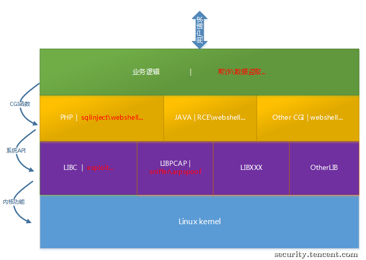
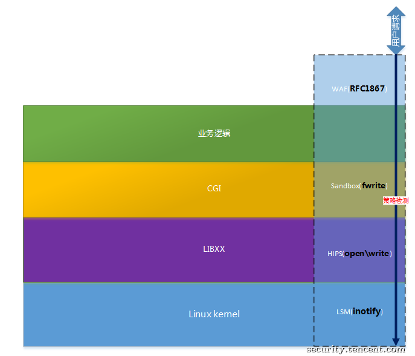
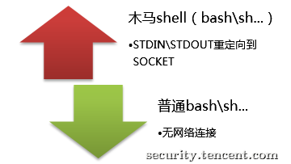
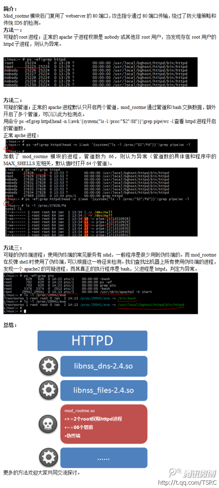
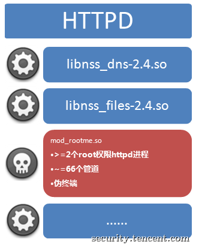

原文 by [tsrc博客](https://security.tencent.com/index.php/blog/msg/61)  

说起攻防对抗，大家很熟悉的一句话是 “攻击只需一点即可得手，而防守必须全面设防”。可见多数时候，防守方很被动。当攻防双方在同一维度活动时，攻击者会有很多途径实现攻击，而防守策略必须不断的叠加来封堵，往往疲于奔命。在互联网公司安全团队有限的人力资源条件下，像杀毒软件或各色ips\ids那样不断累加特征码的方式，需长年累月投入人力且收效未必很好，因此是非常不可取的。  

其实，防守方也是有他的优势的。举例来说，目前常见的攻击手法都是针对目标的web或主机系统层面。而整个战场所在的操作系统以及网络设备均是防守方的，那么理论上防守方可以在任意维度构建安全产品和制定安全策略，相对来说攻击行为则处在一个较低维度领域内活动。  

如何理解这个维度呢，参考图1:       
    

    


## 高维防守  

常常看到yuange提到安全策略(体系)的完备性，通常安全策略被绕过是由于不够完备。如何让策略足够完备呢，笔者认为基于系统的机制、CGI和协议规范较为有效，比不断用新规则新策略去为之前的策略打“补丁”靠谱的多。因为一切攻击与防守所需的基本功能/基本逻辑均来源于此。   

从图1可以看到无论什么入侵行为，其实都对应着更高一维度的系统功能和能力支持。在防守方的主场，不要放着这些有利的条件不用，与攻击者针尖对麦芒的在低维度对抗，犹如遭受了《三体》中的“降维攻击”是不明智的。   
 
 
## 维度分析

以“webshell上传“这个入侵场景为例，在制定防守策略前，先分析一下它在各个维度都有哪些事件发生，见图2。  

  

## 策略实践      

梳理清楚了“webshell上传”这个场景在各维度的技术细节，如何制定不易绕过的策略就相对容易了。  

* 网络层：检测符合RFC1867标准的上传CGI行为  
无论什么漏洞和那种猥琐的攻击，他总是要符合HTTP协议的。那从高维度的HTTP协议入手，便不用去考虑诸如”XXeditor上传漏洞”、“XXCMS上传漏洞“的防护规则了，见图3。    
  

* CGI层面：检测fopen等API事件是否在创建CGI文件  
无论什么CGI漏洞导致的上传，漏洞代码几乎都用有fopen等写文件的操作，见图4。  
  

* 系统用户态：检测系统层面的API调用行为是否在创建CGI文件  
除非websvr直接是root启动且能加载任意代码，否则攻击者几乎很难绕过检测了，见图5  
  

* 系统内核态：通过内核inotify事件来发现CGI创建行为 
在这一层我们甚至不担心root启动的websvr加载恶意代码带来的可能的逃逸行为，至少在完成后续的攻击之前，创建CGI文件的可疑行为必定被发现，见图6。    
  

越高维度的策略，越不易被绕过，联动起来，则更为精准。以上策略检测模型汇总起来，就是图7的样子。  
  

 
## 2个木马检测案例

前面看到，通常供攻击者施展的漏洞利用或攻击渠道能做的事情通常毕竟有限，在防守方在高一维度对事件的观察与检测让攻击方很难逃逸。而对入侵\漏洞场景的细致分析，以及入侵场景关键环节的提炼则是策略制定的关键，否则同样会陷入不断为旧策略打补丁的尴尬境地。  

要解决一个入侵场景，在制定策略之前需要做好足够的分析并提炼其最核心的技术点，贴近此特征制定策略效果就非常好，且不易被绕过。下面选择2个linux系统常见的木马场景和案例来说明。  

熟悉恶意代码取证的同学应该清楚常见的反连木马，‘核心’代码部分一般是这样的：  
``` c
connect(sockfd, (struct sockaddr *)&cliaddr, sizeof(struct sockaddr));
dup2(sockfd, 1); 
dup2(sockfd, 2);
execve("/bin/sh","sh",envp);
```
那防守方的检测就十分简单，通常一个bash进程是不会有网络连接的，所以检测策略是bash的 STDIN/STDOUT绑定了socket则为木马。  

  

有一些老练的木马代码则不会那么偷懒，譬如mod_rootme。为了复用apache的监听端口以及获得root权限的shell，mod_rootme在代码逻辑上作了很多精巧的变换组合，使得检测不能像普通木马一样方便。TSRC官微曾经有分享过如何发现mod_rootme这类极为隐蔽的后门。  
  
  
但是，再狡猾的后门，他也有异于系统正常行为的地方，比如mod_rootme会存在多于2个root权限的httpd进程、apache进程开启多个管道并且使用了伪终端，根据异常行为建立策略是相比签名特征更为靠谱的检测手段。  

  

## 总结

安全设备与检测系统布置在合适的维度可以使得防守处于非常有利的位置，同时尽可能的提炼入侵场景的关键环节，则是检测思想的精髓。  

笔者认为甲方安全团队应该尽量避免针对每一个漏洞和黑客攻击手法制定个性化防护的策略，那样看似大而全，实际却难以穷举同类场景并难以维护。  

针对自身业务特点，分析其主要风险，针对性的制定策略。将有限的资源用于对抗清晰的风险场景，才是更为可取且有效率的事。  