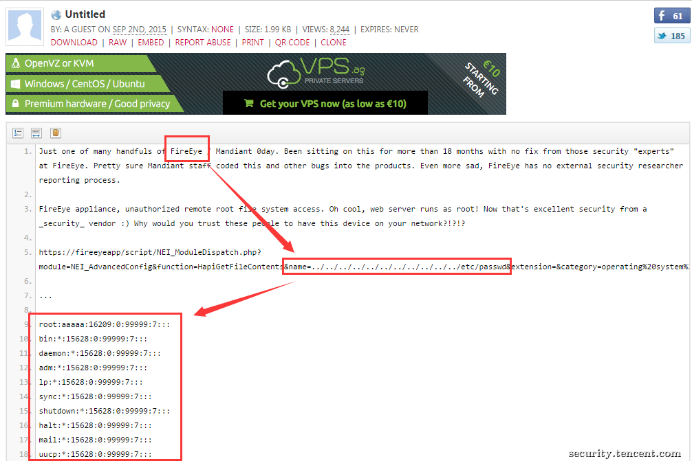

原文 by [tsrc 博客](https://security.tencent.com/index.php/blog/msg/95)  

## 【背景】
 
阿里云盾9月1日升级后出现bug，阿里云服务器上用户执行什么命令，什么命令就被删除，为用户带来一定影响。阿里云盾负责人道哥发表文章《[危机时刻，我只心疼我们的客户](http://zhuanlan.zhihu.com/taosay/20197586)》做出澄清和反思，说他“经历了非常难忘的一天”。InfoQ对道哥的采访也解释了《[阿里云9月1日安骑士升级故障真相](https://www.infoq.com/cn/news/2015/09/aliyun-yundun)》。  
 
举一反三，这个事件发生后，我们对腾讯的相关安全系统也做了一番梳理、探讨、反思和整改，借着这个机会，我们想跟业界共同探讨一下安全产品设计时应当注意的一些问题。  
 
##【安全产品引发的不安全】
 
前事不忘后事之师，先来盘点一下业界一些因为安全产品引发的故障案例。  
 
### 1）杀毒软件和补丁升级的风险  
 
历史上安全产品引发业务故障的事情其实并不新鲜，比如说早些年[赛门铁克误杀Windows系统文件](http://netsecurity.51cto.com/secu/07051803001/)、[卡巴斯基误杀Windows系统文件](http://tech.163.com/07/0521/16/3F1G37J8000915BF.html)，均导致计算机异常。  
 
哪怕是Windows官方提供的补丁，有些场景下部署了也会蓝屏 —— 所以在传统金融行业，有些核心服务器为了保障可用性，是不会安装杀毒软件也不会打补丁升级的。  
 
### 2）漏洞检测引发的风险  
 
即使不在客户的计算机或者服务器上安装任何东西，单纯开启漏洞扫描器去探测客户是否存在已知风险，也有很大的几率导致目标服务器蓝屏、死机、丢失数据。   
 
比如说，笔者了解到，曾经公司某业务就会把扫描器提交的参数全部都写入生产环境的数据库里，导致数据错乱；而有些扫描器在测试SQL注入漏洞的时候，可能就会引发服务端的一个不带where条件的update或者delete，造成数据丢失；更别说探测一些系统内核级别的漏洞引发的蓝屏、死机、重启、拒绝服务、crash等现象了。    
 
### 3）实时阻断类产品引发的风险
 
有一些安全产品，比如IPS、WAF ，一旦识别出恶意的攻击行为，就会对攻击源进行阻断，避免攻击的发生——问题是，如果出现误报将正常请求拦截了，该如何应对呢？  
 
对于可用性要求极高的业务来说，这几乎是不可接受的。所以，绝大多数安全团队永远不会开启IPS的阻断功能，仅仅当作IDS在用。而WAF等安全产品，则必须严格区分“发现策略”和“阻断策略”：  
 
发现策略可以有适当的误报，但是最好没有漏报。而阻断策略则必须没有误报，可以有漏报。  
 
与此同时，自己发起的阻断，要给业务足够多的信息提示—— 否则有时候业务debug几天下来才发现其实是WAF阻拦、篡改了请求，换位思考，感受一下业务的怒火，就知道我们该怎么做了。  
 
### 4）单点串联产品故障 
 
有一些DDoS/WAF产品是串联部署在业务的网络里的，或者进入防护状态的时候，会串联到业务的网络路径中。一旦这些产品出现bug，就可能造成业务中断。  
 
好玩的地方来了：原本为了保障可用性的安全产品引入，反而导致了可用性的故障，而这些故障的原因如果归因为我们无法提供稳定的高质量研发水平时，业务很可能宁可被攻击也不会再用我们的服务。  
 
### 5）安全产品自身存在漏洞
 
最近FireEye这个APT领军厂商被报告旗下某产品Web管理入口存在漏洞，而且该服务还是以root权限运行的 —— 无论是漏洞的低级程度，还是安全规范的符合程度，都无法跟FireEye的盛名相匹配起来。  
  

安全人员站在制高点上指责业务开发团队没有遵循SDL后，自己转变成产品的制作方，却同样重复这些错误。  
 
同样的案例，在国内“自主研发”的跳板机、堡垒机等行业也不鲜见，xtiger同学之前就发现过一些类似产品的RCE漏洞，同样获取了root权限。    
 
试想，统一集中管理认证的中心存在低级漏洞时，我们要如何说服业务把鸡蛋放在这个篮子是安全的？  
 
## 【意料之外，情理之中】
 
安全产品引发不安全因素，虽然看起来意外，其实却有它的必然性。  
 
在很多地方，负责研发、维护这些安全产品的开发团队，人手并不如明星产品那样每一个模块、每一个职能都有成熟的分工和千锤百炼的流程护驾。  
 
部署到数十万台主机的Agent，也许只是3、5个研发人员花了几个月“敏捷迭代”出来的产品，没有专业的运维团队，没有专业的QA、发布流程，没有DO分离……   
 
3、5个人，10来条枪，决策者的还是那个做攻防出身，几乎没有研发经验的领导，偶尔质量出一点问题就很容易理解了。  
 
同样的产品，在乙方，开发、测试、运维、策略运营、售前售后分工都非常清晰，各司其职，通过严格的流程进行质量控制。其管理成熟度应该远远高于大部分甲方安全团队—— 然并卵，上一节举出的案例也证明了，即使在乙方足够投入的前提下，也不一定能够避免所有的意外发生。  
 
那么，我们要怎么应对呢？  
 
## 【安全产品的自我修养】
 
腾讯安全平台部（早年叫腾讯安全中心）2005年成立，经过一段时间的摸索，2008年开始就逐步在研发自己的安全产品，包括漏洞扫描平台、主机安全Agent（代号“洋葱”）、DDoS检测防护平台（代号“宙斯盾”）、Web防护平台（代号“门神”）等几个大的系统和平台，一路走来也遇到了各种坑（宕过机），也逐步摸索到安全团队自主研发及质量管理的一些门路，现在笔者在前人的基础上斗胆总结出来，供大家参考。  
 
### 1）架构设计与定位
 
在设计安全产品和做自我定位的时候，是否可以充当“保姆”其实是非常值得商榷的。比如我们的主机安全Agent为了保证不影响业务，牺牲了非常多“理论上可以做”的安全特性，尤其是阻拦性质的。  
 
洋葱系统会严格跟限制自身的CPU占用率、内存使用率、文件打开数量、日志文件大小等等，充分避免因自身问题引发主机层的业务故障（如果使用超过了指定的资源，安全Agent会把自己kill掉，同时运营人员会介入Agent离线事件）。  
 
虽然洋葱的大部分功能是“只读”的，小心避免修改业务环境。但是，哪怕是“只读”的操作也可能是有风险的。比如我们绝对不敢轻易使用netstat、lsof 等指令 —— 这些指令会遍历当前打开的文件句柄，在某些服务器上，数十万的连接数遍历一遍能把CPU、IO占用率提升到业务无法接受的程度。  
 
对于发现的安全事件，同样是“只读”操作—— 发出安全工单，由应急团队立即跟进处理，任何删除文件或者关闭服务的“写”操作都必须由业务运维同事自己来执行 —— 安全Agent当然有这个能力，但是非特殊紧急必要情况不能使用。  
 
### 2）严格遵守研发流程
 
说实话，腾讯安全团队发展到今天的规模之前，也经历过小作坊式的开发阶段，同样用3、5个人完成了当时极具挑战的开发任务，也逐步建立起来完善的研发流程。  
 
每一个项目、需求的实现，会在内部项目管理系统TAPD中先做登记、审核。可以有1个开发兼任需求确认、代码实现、测试等不同的角色，但是每一个流程和环节却不能省—— 敏捷不代表可以不尊重流程管理和质量控制。  

代码实现好之后，如果要发布到线上，必先经过灰度测试、拨测观察再扩大规模。而且，积累了无数血泪教训之后，腾讯还有“周五不变更”的文化，这种流程和文化会随在新人入职的第一个月就通过各种导师传帮带和部门级培训植入到每一个人的骨髓里。  
 
### 3）投入专业运维团队
 
做安全的同学很长一段时间里并不太理解做“运维”的。在大家眼中，运维仿佛是装个操作系统，写个脚本初始一下环境，再执行一下发布变更流程的“打杂角色”。  
 
但是，事实上，专业的运维团队，能够通过优化系统、部署监控和严格执行专业的发布、变更流程，来控制住很多风险。比如，打造拨测监控系统，模拟业务请求的方式监控业务的可用性、性能延迟，能够在用户投诉之前第一时间自己发现大部分问题。  
 
可惜的是，很多安全团队有能力投入一个作坊式的开发班子就很不容易了，这个开发班子往往自己还要负责运维发布，于是运维这个专业领域里被填过很多年的坑，安全团队都要自己再走一遍。  
 
我们部门很早就专门成立了相关团队，将一些大数据、海量性能的公共基础技术研发资源集中起来，同时也成立了专业的运维团队给其它安全产品提供支持，极大程度的避免了上述的坑。  
 
### 4）数据运营与响应
 
除了投入运维人员之外，一个安全产品的生命和灵魂其实在于运营。  
 
所谓的运营，就是要让安全产品发挥预期的价值，并且减少一切可能影响达到目标的风险。因此，运营同学会深入了解安全产品设计和实现的原理，采集、生产数据的真实含义，建设一整套数据指标。  
 
这些数据指标，有些是从业务角度衡量产品成功性的，比如主机Agent部署到了多少台服务器上，多少在线，多少离线。发现多少安全问题，漏报多少，误报多少。  
 
有些则是衡量自身质量和健康性的，比如上报数据通道中，每一个环节提交的数据，和下一个环节收到的数据是否能够对账，是否存在丢包。  
 
还有一些，则是定位于故障类型的检测，比如是否引发了业务性能、资源的异常。  
 
通过数据运营的方式，运营人员每日实时响应各种异常，协调运维、研发将各种问题及时化解，维护自身的口碑，往往也更加深入的理解当前方案存在的局限性可以持续的优化和控盘。  
 
### 5）产品化
 
不少安全产品从出身开始，就将自己定位于“能够实现功能即可”。对于用户交互、功能接口、故障排查、可运维性、可运营性等方面考虑的都极少。  
 
我见过一个控制账号管理的安全产品，其Web管理后台真心只是把LDAP所支持的每一个参数和功能罗列了出来，完全没有考虑用户在使用这些功能和参数的频率、填写逻辑。  
 
很多系统甚至将一些运营策略hard code到代码里，能够短时间解决问题就上。时间长了，在版本管理上就一片混乱，debug的时候心情也就非常感人了。  
 
早些年我们的安全系统也一样“能够实现功能即可”，不过随着安全系统为[腾讯云](http://www.qcloud.com/product/qc.html)提供支撑（腾讯云上的DDoS防护、DNS劫持检测、漏洞检测防护等安全功能由我们提供），我们也正在摸索尝试产品化了。  

### 6）策略运营
 
安全产品毕竟是一个平台，要部署“安全策略”才能实现自己的业务价值。可惜很多负责设计和部署安全策略的人员，并没有太多全局的视野和评估能力，他们不知道，有些“阻断策略”、“打击策略”虽然理论上能够把坏人抓出来，但是如果误伤好人，对自身产品的运营伤害反而更大。  
 
因此，严格区分“发现策略”和“打击策略”，在“发现”的时候接受更多的误报，人工离线筛选和运营，测试策略效果，在“打击”策略上更注重“精准”和“有把握”。  
 
## 【总结】
 
安全团队能够投入研发力量，设计和开发自己的产品本身已属不易。但是这个开发过程和普通的产品开发过程并没有什么不同，软件工程领域成熟的方法论、流程、运维工具、质量管理体系、安全开发方法，对于我们自己依然有效。  
 
最后，本文仅是个人的一点浅见，旨在抛砖引玉，欢迎大家一起来探讨。  